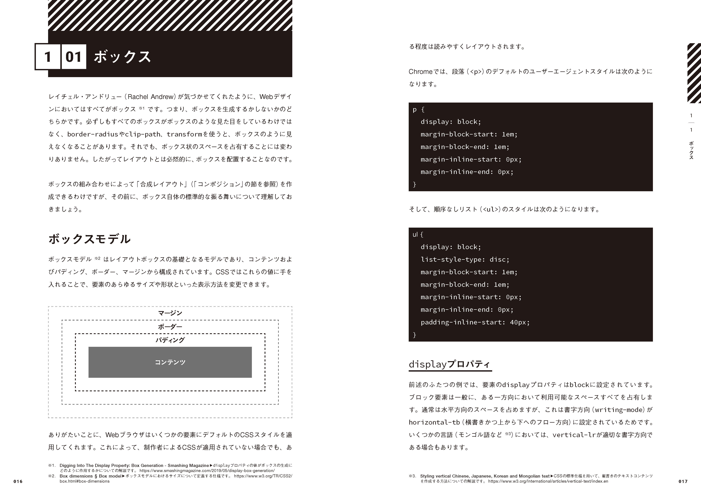
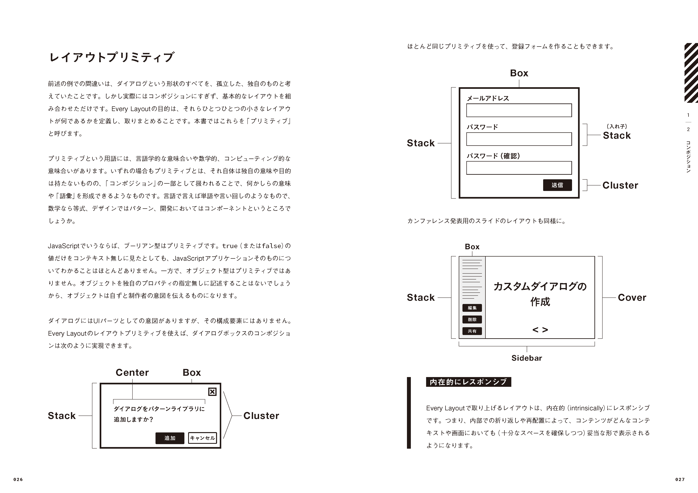
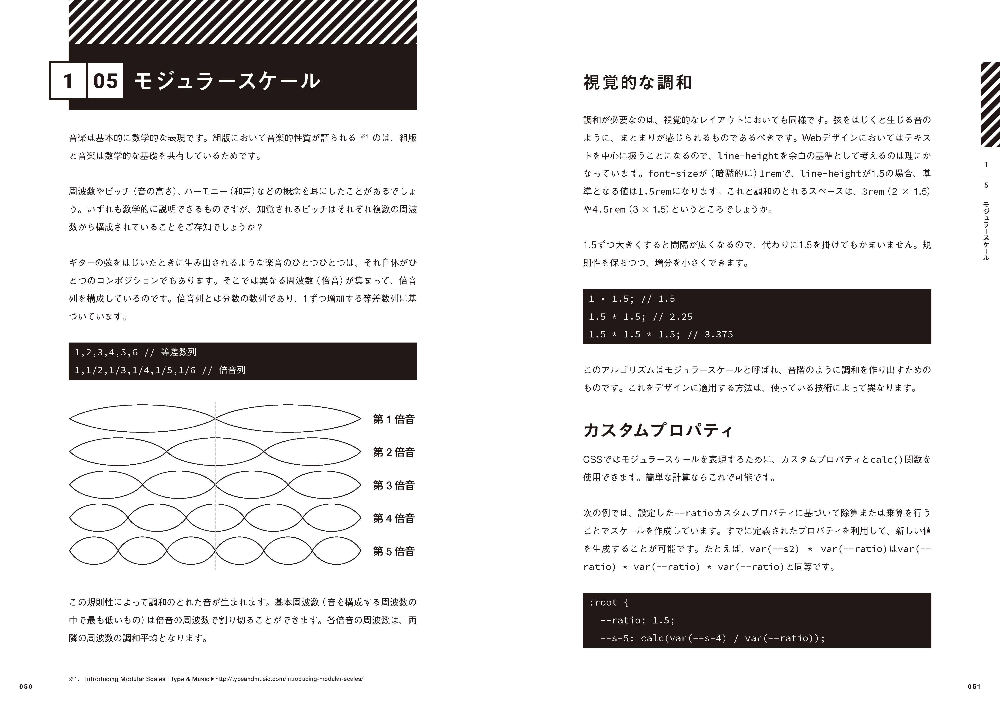
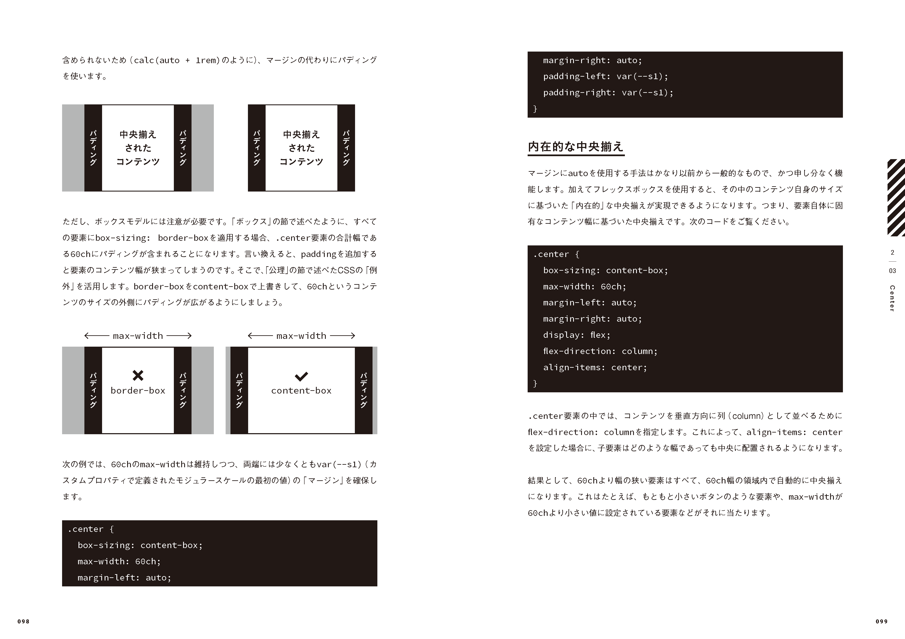
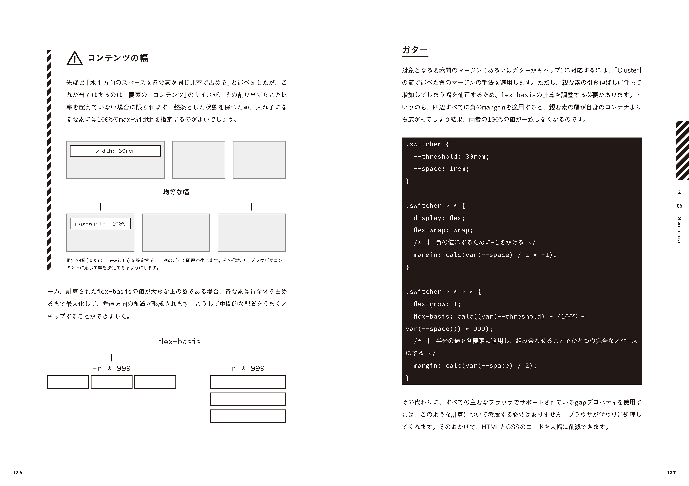
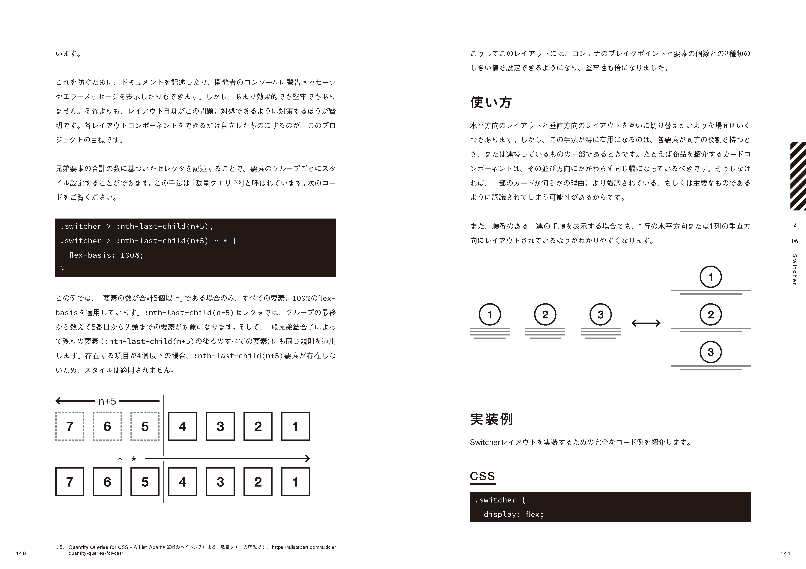
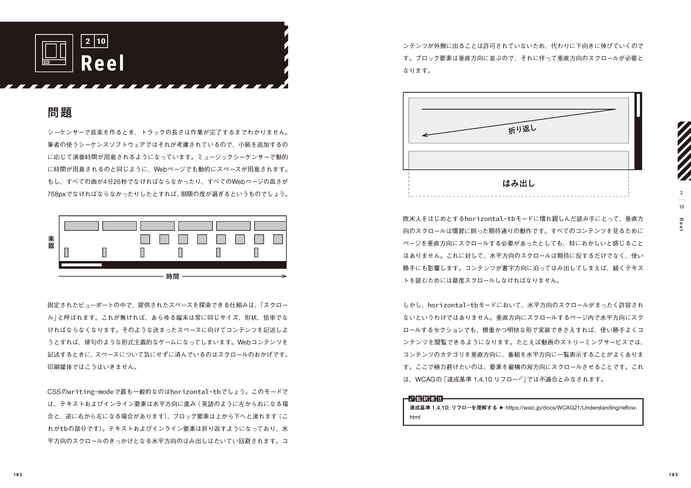
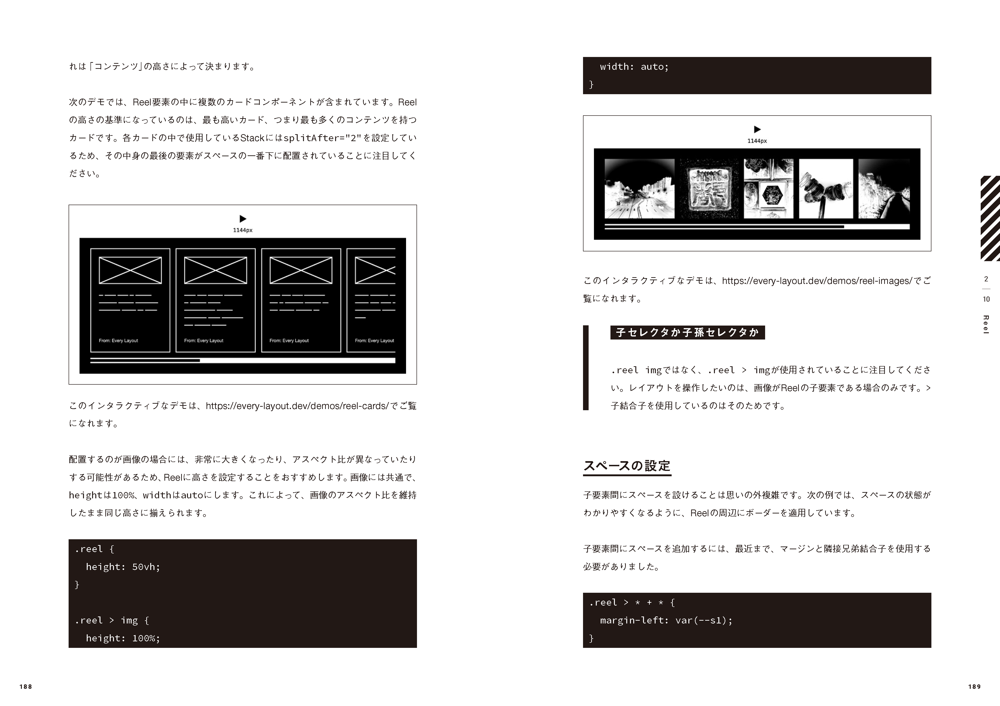
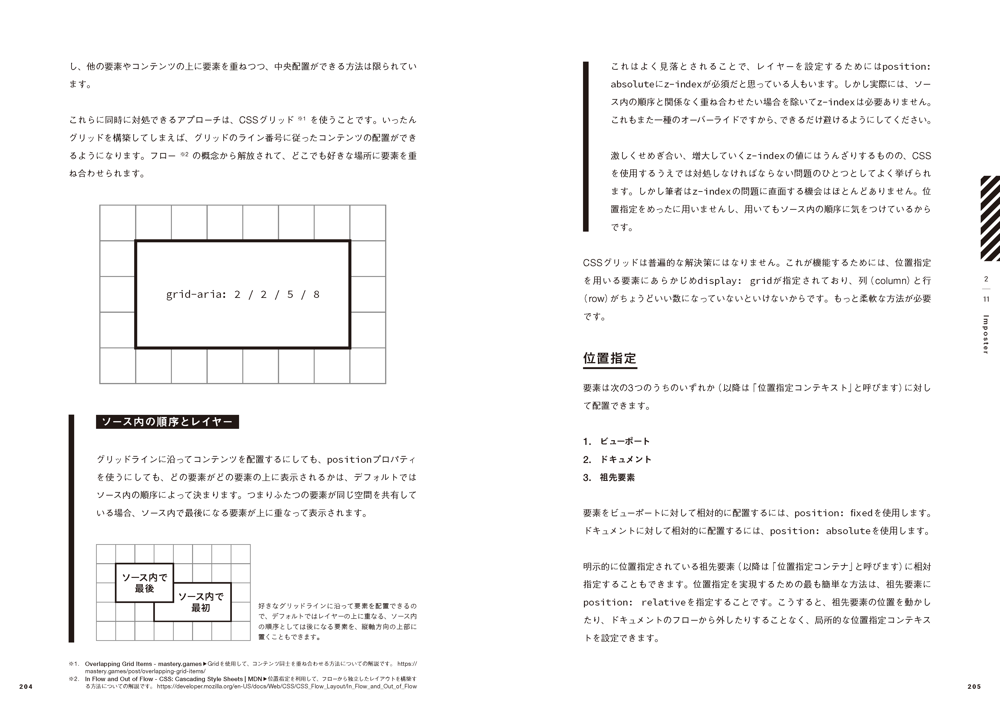
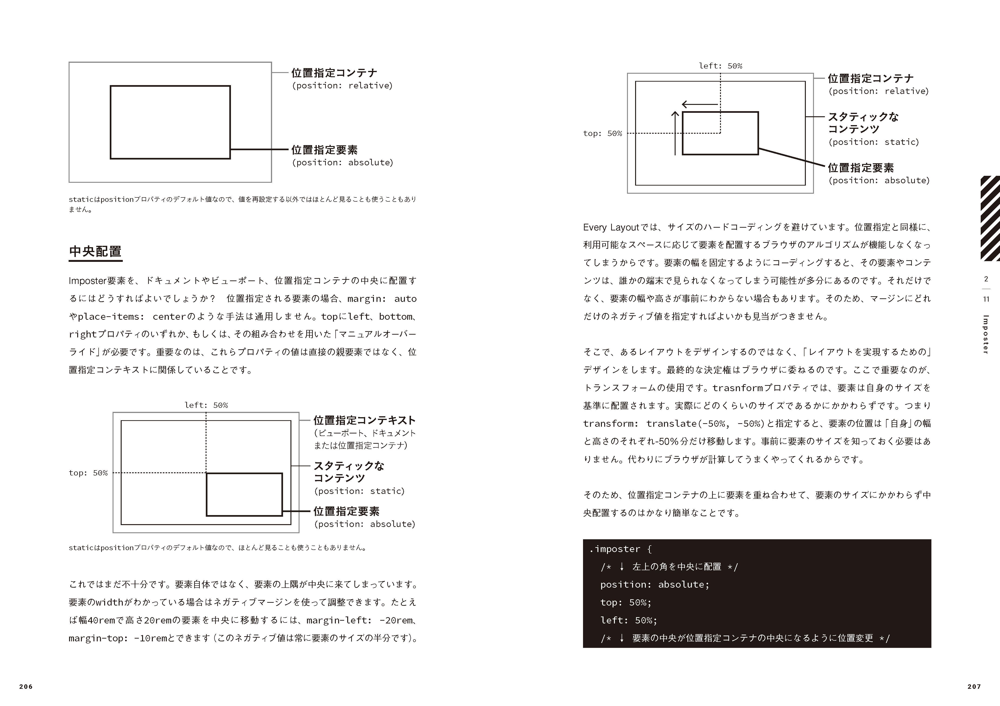

import { Image } from 'astro:assets';
import cover from './assets/2021-10-11-publication-of-everylayout/cover.png';

<figure>
  <Image class="w-96" src={cover} alt="" />
</figure>

友人の[腹筋ローラーの力を信じろ](https://twitter.com/8845musign)さんと共に監訳を担当した書籍『[Every Layout&mdash;&mdash;モジュラーなレスポンシブデザインを実現するCSS設計論](https://www.hanmoto.com/bd/isbn/9784862465177)』が出版されます。現在、[Amazonで予約受付中](https://www.amazon.co.jp/dp/486246517X)です。当初の予定よりもかなり遅れてしまいましたが、内容はいまだ鮮やかなままに思えます。

<figure></figure>

<figure></figure>

<figure></figure>

<figure></figure>

<figure></figure>

<figure></figure>

<figure></figure>

<figure></figure>

<figure></figure>

<figure></figure>

目次:

- [日本語版に寄せて](https://book.borndigital.jp/support/EveryLayout/EveryLayout_contents.pdf)
- [監訳者まえがき](https://book.borndigital.jp/support/EveryLayout/EveryLayout_contents.pdf)
- Chapter 1: 基礎
  - 1–01: ボックス
  - 1–02: コンポジション
  - 1–03: 単位
  - 1–04: グローバルスタイルとローカルスタイル
  - 1–05: モジュラースケール
  - 1–06: 公理
- Chapter 2: レイアウト
  - 2–01: Stack
  - 2–02: Box
  - 2–03: Center
  - 2–04: Cluster
  - 2–05: Sidebar
  - 2–06: Switcher
  - 2–07: Cover
  - 2–08: Grid
  - 2–09: Frame
  - 2–10: Reel
  - 2–11: Imposter
  - 2–12: Icon
- 索引

---

もとになっているのは、ウェブサイト「[Every Layout](https://every-layout.dev/)」です。同サイトにある「Relearn CSS layout」というコピーの通り、本書は、すでにある程度CSSについての経験を積んでいる制作者のための書籍です。レイアウトがテーマではありますが、ある決まった見た目を模写する練習帳のようなものではなく、CSSのもっと抽象的な設計方法について論じたものです。

少し乱暴に言えば、「レスポンシブデザイン」と「CSS設計」と「デザインシステム」をまとめて一つの視点で解説したような内容になっています。これらは本来、CSSという技術領域の上で重なり合う分野であり、切っても切れない関係です。しかし議論としては各論に分散する場面が多く、それぞれの分野が相互に影響し合う領域については、あまり知識が集積されてこなかったように感じます。そうした分野の交差点において、体系化された理論を提示できることは、本書の一つの意義です。

また、CSSらしい考え方を身につけるための本とも言えます。1章では、CSS固有の性質をうまく活かしながら、いかにして効率的で堅牢なスタイリングを実現するかという基礎的な方法論について詳しく解説しています。経験豊かな開発者が無意識に身につけているものの、なかなか言葉にできなかったような経験則を、巧みに繋ぎ合わせて体系化しています。

2章では、これらを踏まえつつ、具体的なレイアウトパターンの紹介に移ります。一つ一つが「レイアウトプリミティブ」と呼ばれるコンポーネントになっています。非常に再利用性の高いコンポーネントであり、うまくプロジェクトに導入できれば、レイアウトのための必要なCSSが大幅に削減できて、結果的に全体の設計もシンプルになります。

このような書籍は私自身にとっても待望でしたが、一方で、これまで現れてこなかったのも仕方のないことに思えるのです。

CSSを巡る状況は非常に複雑です。

CSSはスタイリングのための言語であると同時に、ウェブデザインの素材そのものであり、「デザインのためにデザインされたもの」でもあります。つまり、デザイナー自身が使うためにあるのです。 スタイルが*どうあるか*よりも、*どうあるべきか*を起点としながら事象を導くのがCSSの考え方です。言わばその遠回しなルールの記述こそがデザインであり、CSSの勘所です。

しかし、デザインカンプを中心としたワークフローでは、デザイナーはCSSに触れず、あるいはCSSについて意識することなく制作してしまうという状況が珍しくありません。すると自らのデザインにおいて、CSSが持つ構造との矛盾が生まれたり、前提の誤解があったとしても、それに気づくことができません。その結果、成果物を引き継いだCSSの担当者は、多かれ少なかれ不条理に苛まれることになります。筋の悪い構造を無理やり実現しなければならない場面も多く、管理するCSSは不必要に複雑なものとなっていきます。

また、デザインカンプ前提のワークフローからキャリアを始める多くの開発者にとっては、デザインカンプの通りに模写することこそが最重要事項と捉えられてしまいがちです。CSSをうまく活用したよい慣習について学べる機会も少なく、構造上の問題を覆すために設計の前提を見直すような発想に至れるだけの力も身につけられません。

昨今では、CSSのためのツール選定としては非常に多様な選択肢があります。CSS in JSやCSS Modules、ユーティリティファーストCSSなど、それぞれの思想をもってCSSの使い方を見直そうとする姿勢が見受けられます。とはいえ、いずれもCSSを置き換える類いものではなく、CSSを少し抽象化した、CSSの延長線上にあるものです。プレーンで普通のCSSをうまく使えるからこそ、こうした発展的な技術もよく理解できるのです。しかし、普通のCSSの経験が乏しいままに、いきなりこうしたツール群に気を取られてしまうと、学習としては遠回りなものになって、たくさんの時間を無駄にしてしまいます。

個人的な経験から言えるのは、CSSの難しさの割合の大部分を占めるのは、その周辺事情の複雑さだということです。ズレの積み重ねによって、CSSは本来よりもずっと難しい技術になっています。この問題を根本的に解決するには、ズレを少しずつ解消して、付随的な複雑さを可能な限り取り除くことです。そのためには、いくつもの方向からさまざまなアプローチが必要となるでしょう。

こうした状況がある中において、本書の最大の特徴と言えるのは、その包括的なアプローチです。CSS開発者のためだけの部分最適な理論ではなく、ユーザーを含めた全体から見て本質的にどのようにデザインすべきか。複雑さを本質的に取り除くためにはそうした視点が欠かせないのです。しかしそのためには大きな発想の転換が求められることもあり、目の前の仕事に適用するのが難しい場合もあるはずです。ワークフローを変える必要に迫られるかもしれませんし、見方によっては理想論と一蹴されてしまうでしょう。

しかし重要なのは、いくつもの「考え方」を持っていることです。目の前の状況を相対化して、よりよいものにしていくためには、多くのことを学び、選択肢の数を増やし、都度適切なものを選び取れるようにしておく必要があります。その意味で、本書は、多くの人にとって新鮮な驚きをもたらしてくれる一冊であるはずです。

- [Every Layout-モジュラーなレスポンシブデザインを実現するCSS設計論 | ヘイドン・ピカリング, アンディ・ベル, 安田 祐平, 横内 宏樹, 佐藤 英一, 株式会社Bスプラウト |本 | 通販 | Amazon](https://www.amazon.co.jp/dp/486246517X)
- [Every Layout モジュラーなレスポンシブデザインを実現するCSS設計論 ヘイドン・ピカリング(著/文) - ボーンデジタル | 版元ドットコム](https://www.hanmoto.com/bd/isbn/9784862465177)
- [【PDFダウンロード版】Every Layout－モジュラーなレスポンシブデザインを実現するCSS設計論 - ボーンデジタルオンラインブックストア](https://wgn-obs.shop-pro.jp/?pid=164656047)
- [Relearn CSS layout: Every Layout](https://every-layout.dev/)

---

翻訳のレビューとしては、[terkel](https://twitter.com/terkel)さんと[ろくぜうどん](https://twitter.com/rokuzeudon)さんにご協力いただきました。文章として違和感があったり、表現が伝わりづらかったりした部分については、お二人の助言のおかげでかなり改善できたように思います。
