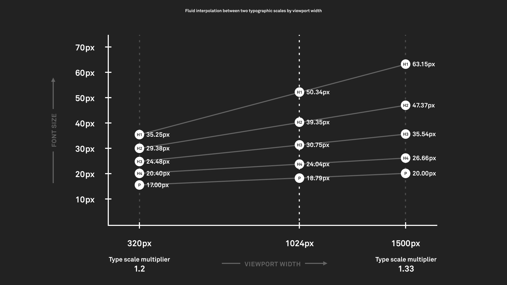
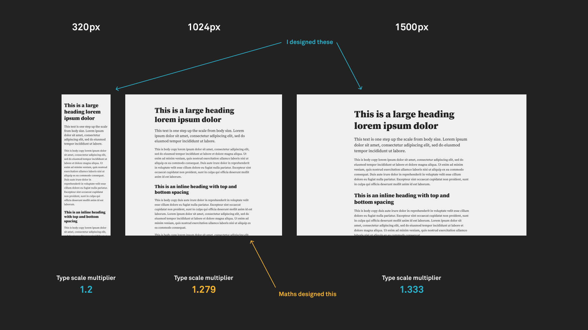
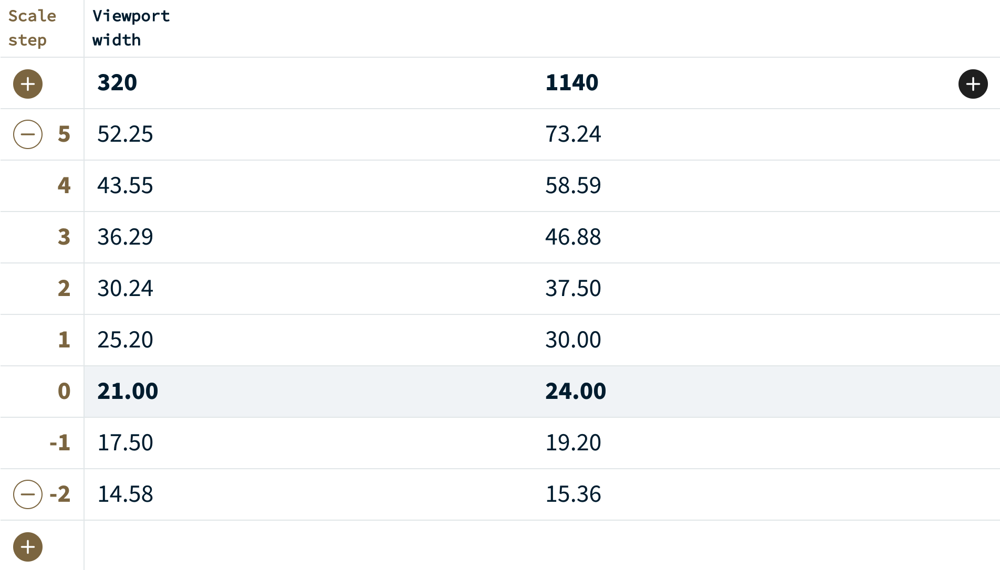
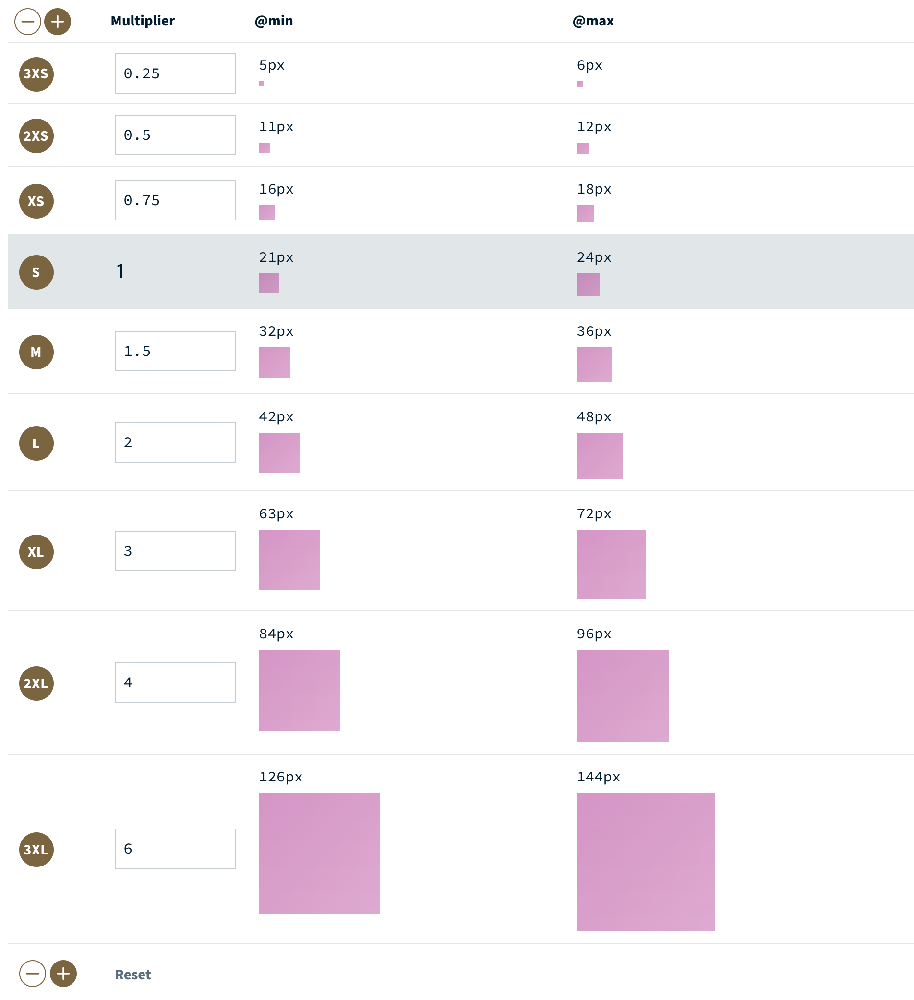
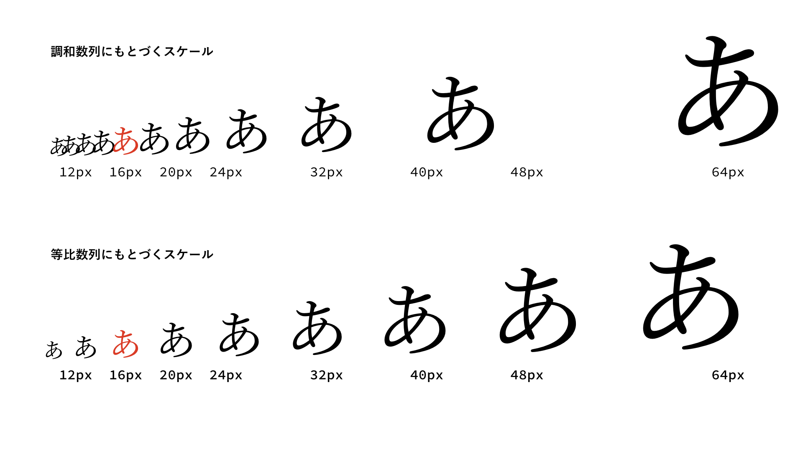
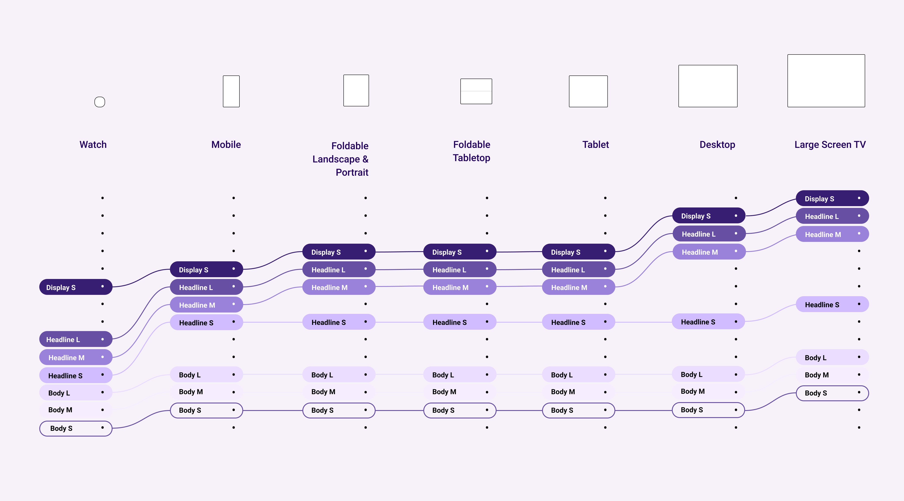

少し前に担当したウェブサイト制作の案件で、[Utopia](https://utopia.fyi/)というツールを使ってみた。Utopiaを使うと、ビューポートの幅に応じて流動的に変化するフォントサイズとスペーシングの値のセットを生成できる。

<figure>
	
	<figcaption>&mdash;&mdash;<a href="https://utopia.fyi/blog/designing-with-fluid-type-scales">Designing with fluid type scales | Utopia</a></figcaption>
</figure>

レスポンシブデザインのパターンとして、ビューポートの幅が狭ければテキストのフォントサイズは小さめで、広ければ大きめにしたい、という場面がよくある。そうしたとき、フォントサイズを変更するために、ブレイクポイントごとに値を上書きする設定をしていくと、組み合わせ地獄になってデザインルールが非常に複雑化してしまう。フォントサイズの数とブレイクポイントの数がかけ合わさった分のルールが生まれて、後から整理しようとしても手に負えない状況になる。

この組み合わせ地獄を回避するために、Utopiaのアプローチでは、まずフォントサイズを実際のピクセル数ではなく、ステップとして捉える。そのステップと対応する実際のフォントサイズは、ビューポートの幅に応じて自動的に導出される、という考え方になる。

CSSにおいては、特定のステップ数をフォントサイズの値として設定しさえすれば、それだけで自動的にちょうどいいサイズが適用されるようになる。そういう実装にする。結果、ブレイクポイントごとにフォントサイズを設定し直す必要がなくなる。

<figure>
	
	<figcaption>&mdash;&mdash;<a href="https://utopia.fyi/blog/designing-with-fluid-type-scales">Designing with fluid type scales | Utopia</a></figcaption>
</figure>

フォントサイズの値が変化する始点と終点に当たる数値は、モジュラースケールによって導出される。

幅が375pxの場合&mdash;&mdash;

- 基準となるフォントサイズは14px
- モジュラースケールの係数は1.2

幅が1440pxの場合&mdash;&mdash;

- 基準となるフォントサイズは18px
- モジュラースケールの係数は1.25

こういう具合でUtopiaに入力すると、次のように値が出力される。

<figure>
	
	<figcaption>&mdash;&mdash;<a href="https://utopia.fyi/type/calculator/">Fluid type scale calculator | Utopia</a></figcaption>
</figure>

フォントサイズだけでなく、似たロジックを使ってスペーシングの値のセットを生成する仕組みも備わっている。これらの値は、マージンや要素のサイズ設定などのために使用できる。

<figure>
	
	<figcaption>&mdash;&mdash;<a href="https://utopia.fyi/space/calculator/">Fluid Space Calculator | Utopia</a></figcaption>
</figure>

案件を担当するデザイナーとはUtopiaの考え方について話して、これを使ってフォントサイズとスペーシングの値を設定してもらうことになった。Figmaで作るデザインカンプでももちろんこのルールに基づいてデザインする。

こうして案件をひとつ完遂したけれど、結論としては、次からは使わないと思う。しかしこれは必ずしもUtopiaのアプローチが合わなかったというわけではなくて、メリデメがいろいろあった上での総合的な評価結果にすぎないので、詳しい経緯を記録しておく。

## うまくいったこと

スタイルとして設定する値について、あらかじめ正しく共通認識を持てるようになったことは普通によかった。いわゆるデザイントークンというやつ。これによって、デザインカンプがより精緻なものになって、「なにが正解なのかわからない状態」をかなり減らすことができた。

というのも僕の経験では、デザインカンプ上で各要素に適用されているフォントサイズやマージンの値に規則性を見い出せなくて、開発担当者がCSSとしてうまく表現できないような場面がよくある。すると、開発担当者がデザイン仕様をよしなに「調整」した上で実装し、それをデザイン担当者に確認してみて、フィードバックを受けて場合によってはまたそれをやり直すという余計な仕事が発生する。その際には細かい指示が増えがちで、「この箇所だけフォントサイズを2px大きくしたい」とか、「こことここはマージンを揃えて、あっちは少し広げたい」みたいな、人間同士でやるにはストレスフルになるようなやり取りをすることになる。しかしその実は、前工程での検討が不十分だったためとしか言えないような指示も少なくない。

問題は、設計段階においてその意図が明瞭になっていないこと。判断のブレを是正するための基準が設けられていないという場合が多い。そこで、Utopiaが生成したフォントサイズとスペーシングを導入することによって、判断の枠が設定されると、確然たる判断をするように半ば強制されることになる。そのおかげで、後でやり直したくなるような生煮えの判断を減らせるのだと思う。

レスポンシブデザインにまつわる事情が絡んでくると、この辺りの判断は余計に曖昧になる傾向があった。前述の組み合わせ地獄によって、ルールはより複雑に、より微妙になっていく。しかしこれについてもUtopiaのおかげで、「値はブレイクポイントにかかわらずステップとして一意に決定される」というシンプルなルールが打ち立てられて、曖昧さを解消できた。

またレスポンシブデザインにおいては、モバイル向けのデザインとデスクトップ向けのデザインで、スタイルはどの程度個別化されたり共通化されたりするのが妥当かという問題がある。どうにも場合によるところは大きいけれど、それぞれで視覚的な階層構造が共通している限りは、フォントサイズについてはステップ数さえ決まっていれば再設定の必要はほとんどないと言えそうだ。

開発は複数人で行った。Utopiaの採用によってルールの単純化が実現された結果、担当者ごとの実装のブレはかなり抑えられたように思う。特にレスポンシブデザインを採用する場合の開発では、通常、デザインカンプでは表現されない仕様が大量にあり、開発担当者によってまったく違った実装になってしまうことが珍しくない。こうした個人の解釈に依ってしまう部分がUtopiaによって補完され、いたずらな判断のばらつきを平坦化できた。

## うまくいかなかったこと

すべてのフォントサイズの値が流動的に変化するのはやり過ぎだった。Utopiaを素直に使うと、ビューポートの幅が広がるにつれて、どのフォントサイズも漏れなく拡大されていくのだが、本文よりも小さいフォントサイズまでもいっしょに大きくなっていくのは不都合だった。全部の要素を大きくしたいのではなくて、メリハリをつけるためにジャンプ率を高めたいという場面が多いので、小さいテキストはそのままでいいことになる。

加えて、モジュラースケールはやはり使い勝手がよくなかった。[「音楽、数学、タイポグラフィ」で指摘された](https://standard.shiftbrain.com/blog/music-math-typography)ように、モジュラースケールでは導出される値の間隔はまばらになるが、より使用頻度が高いのは本文のフォントサイズ周辺の値だ。本文を中心としたデザインであればあるほど、そこからの差異を表現するために必要なギャップは少しでよくなる。それなのに、ステップ同士の間隔が空きすぎているとその辺りの調整がやりづらいことになる。

<figure>
	
	<figcaption>&mdash;&mdash;<a href="https://standard.shiftbrain.com/blog/music-math-typography">音楽、数学、タイポグラフィ - シフトブレイン／スタンダードデザインユニット</a></figcaption>
</figure>

スペーシングについては、Utopiaの値を使いつつも、けっきょくブレイクポイントで上書きする場面が多かった。フォントサイズと違って、マージンなどについては、一般化したルールに則ってやるのが難しかったということだ。

## 次に試していること

フォントサイズにまつわるルールの複雑化を回避するという意味では、Utopiaのように値を流動的に変化させるアプローチは別に必須ではない。ブレイクポイントごとにフォントサイズを上書きするにしても、その組み合わせをパターン化することさえできていれば問題にはならない。

たとえば「ヘッドライン」というパターンを作って、モバイルの幅では40px、デスクトップの幅では48pxというルールを定めておく。同様に、「ボディ」や「キャプション」なども追加した上で、テキストのスタイルは必ずこれらを参照して決定されるということにすればよい。

<figure>
	
	<figcaption>&mdash;&mdash;<a href="https://m3.material.io/styles/typography/overview">Typography – Material Design 3</a></figcaption>
</figure>

これらのパターンのなかに、行の高さやトラッキングなどもいっしょに含めておくと、さらにルールの一貫性を高めることができるし、開発も楽になる。いま担当している案件では、デザイナーがページの制作を進める傍らで、こうしたタイプスケールも定義してもらっている。

<figure>
	
	<figcaption>&mdash;&mdash;<a href="https://material.io/design/typography/the-type-system.html#type-scale">The type system - Material Design</a></figcaption>
</figure>

さらに、タイプスケールやスペーシングだけでなく、そのほかのいろいろな値（デザイントークン）を一元管理できればなおよい。そこで、[Figma Tokens](https://jansix.at/resources/figma-tokens)というプラグインを導入することにした。これを使えば、テキストやスペーシングに限らず、カラーパレットやボーダー、不透明度などもトークンとして管理できるようになる。Figma Tokensにトークンを設定すると、それらに対応するボタンが出現して、クリックするとレイヤーに適用できるという仕組みになっている。トークンの設定はJSONで入出力できるので、[Tailwind CSSのデフォルト値をJSON化](https://gist.github.com/yuheiy/e1fc01fc0a4816924d1959221fdba46c)し、デザイナーと共有している。
