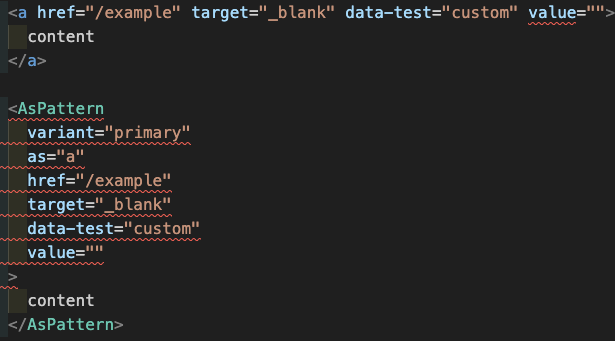

ReactのUIコンポーネントライブラリを使っていると、あるコンポーネントによってレンダリングされるHTML要素の種類を変更したくなる場面がある。たとえば、通常は`button`要素としてレンダリングされる`Button`コンポーネントを使うときに、代わりに`a`要素を使ってレンダリングしたいというケース。

## `as` prop

そのような場合、一般的には、Buttonコンポーネントに`as` propを実装して対処することが多い。

```jsx
function Button({ as: Component = "button", ...props }) {
	return <Component {...props} />;
}

render(
	<>
		<Button type="button">
			I’m a <code>button</code> element
		</Button>
		<Button as="a" href="/">
			I’m an <code>a</code> element
		</Button>
	</>,
);
```

このパターンは、Polymorphicとも呼ばれる。[styled-components](https://styled-components.com/docs/api#as-polymorphic-prop)や[Material UI](https://mui.com/material-ui/guides/composition/#component-prop)、[Chakra UI](https://chakra-ui.com/docs/styled-system/style-props#the-as-prop)など、数多くのライブラリで同等の手法が採用されている。

このコードだけを見ればごくごく簡単に実現できる機能のように思えるが、TypeScriptとして正しく型付けをしようしたり、[`forwardRef`](https://react.dev/reference/react/forwardRef)を適用したりしていると、そこそこ複雑な実装になってしまう。

具体的な実装方法については、[詳しく解説している記事](https://blog.logrocket.com/build-strongly-typed-polymorphic-components-react-typescript/ "Build strongly typed polymorphic components with React and TypeScript")があったのでそちらに譲る。

ただ、単にその仕組みの実装が複雑になるだけであれば、パッケージ化しておいたものを参照して使えばよい。実際にそれに当たるnpmモジュールもいくつかある。

- [@radix-ui/react-polymorphic](https://www.radix-ui.com/docs/primitives/utilities/polymorphic)
- [react-polymorphic-types](https://github.com/kripod/react-polymorphic-types)

しかし、それ以外にもいくつかの問題がある。かつて`as` propを採用していた[Radix UI](https://www.radix-ui.com/)では、これらの問題を解決するために、`as` propが廃止されて新たに`asChild` propが採用されている。これらの機能を実装した[Jenna Smith](https://github.com/jjenzz)氏によると、いくつかの観点から見て、`as` propは過度な複雑性をもたらすと言う。

<blockquote class="twitter-tweet">
	<p lang="en" dir="ltr">
		I&#39;ve been thinking a lot about the `as` prop for polymorphism lately and wondering why we
		all went down the road of runtime TypeScript polymorphism. It introduces so many unnecessary
		complexities, bloats error messages and kills TS perf... 🧵
	</p>
	&mdash; jenna (@jjenzz){" "}
	<a href="https://twitter.com/jjenzz/status/1423766700885954562?ref_src=twsrc%5Etfw">
		August 6, 2021
	</a>
</blockquote> <script async src="https://platform.twitter.com/widgets.js" charset="utf-8"></script>

一つは、TypeScriptのエラーメッセージが複雑になってしまうこと。たとえば、Reactの要素に間違ったpropが渡されたとき、通常の`a`要素と、`as` propとしてa要素が指定されたコンポーネントを比較すると、明らかに後者の方がユーザーにとって理解しづらい。

<figure></figure>

次に、TypeScriptのパフォーマンスを悪化させること。`as` propの型定義においては、高度な型推論や条件型、ジェネリクスを多用することになり、コンパイルするための負荷が高まってしまう。

そして、`as` propを使うと、元のコンポーネントと`as`に当たるコンポーネントの双方に対するpropを同時に記述することになり、どのpropがどのコンポーネントのためのものかが理解しづらくなる。さらに、元のコンポーネントと`as`に当たるコンポーネントに同じ名前のpropがあるとコンフリクトしてしまう。

<figure>
```jsx
const ComponentOwnProps = {
	onChange(thing: boolean): void;
};

const Component = () => {/* ... */};

// thing would be `event` type from `input`
return <Component as="input" onChange={thing => console.log(thing)} />;

````

<figcaption>
[\[Polymorphic\] Allow `ComponentType` props to override by jjenzz · Pull Request #779 · radix-ui/primitives](https://github.com/radix-ui/primitives/pull/779#issuecomment-879257075)
</figcaption>
</figure>

## `asChild` prop

これらの問題を解決するために、新たに`asChild` propが考案された。次のようにして使用する。

<figure>
```jsx
import * as React from 'react';
import * as Tooltip from '@radix-ui/react-tooltip';

export default () => (
	<Tooltip.Root>
		<Tooltip.Trigger asChild>
			<a href="https://www.radix-ui.com/">Radix UI</a>
		</Tooltip.Trigger>
		<Tooltip.Portal>…</Tooltip.Portal>
	</Tooltip.Root>
);
````

<figcaption>
[Composition – Radix UI](https://www.radix-ui.com/docs/primitives/guides/composition)
</figcaption>
</figure>

レンダリングする要素を変更する対象のコンポーネントに対して、`as` propの代わりに`asChild` propを付与する。その`children` propとして任意のノードを指定する。

この`asChild` propによって、前述の問題は一通り解決されることになる。

おまけに、`asChild` propの特性としてもたらされるのが、`asChild` propを指定されたコンポーネントを複数に入れ子にできる機能である。次のように記述することで、親に当たるコンポーネントの機能を継承していくことができる。

<figure>
```jsx
import * as React from 'react';
import * as Dialog from '@radix-ui/react-dialog';
import * as Tooltip from '@radix-ui/react-tooltip';

const MyButton = React.forwardRef((props, forwardedRef) => (
<button {...props} ref={forwardedRef} />
));

export default () => {
	return (
		<Dialog.Root>
			<Tooltip.Root>
				<Tooltip.Trigger asChild>
					<Dialog.Trigger asChild>
						<MyButton>Open dialog</MyButton>
					</Dialog.Trigger>
				</Tooltip.Trigger>
				<Tooltip.Portal>…</Tooltip.Portal>
			</Tooltip.Root>

    		<Dialog.Portal>...</Dialog.Portal>
    	</Dialog.Root>
    );

};

````

<figcaption>
[Composition – Radix UI](https://www.radix-ui.com/docs/primitives/guides/composition#composing-multiple-primitives)
</figcaption>
</figure>

### 自前のコンポーネントに`asChild` propを組み込む

`asChild` propはRadix UIのコンポーネントで提供されている機能だが、自前のコンポーネントにも容易に実装できる。[`@radix-ui/react-slot`](https://www.radix-ui.com/docs/primitives/utilities/slot)パッケージを使用するのがよい。

<figure>
```jsx
import React from 'react';
import { Slot } from '@radix-ui/react-slot';

function Button({ asChild, ...props }) {
  const Comp = asChild ? Slot : 'button';
  return <Comp {...props} />;
}
````

<figcaption>
[Slot – Radix UI](https://www.radix-ui.com/docs/primitives/utilities/slot)
</figcaption>
</figure>

TypeScriptを使用しつつ、`forwardRef`を適用する場合は、次のように記述する。

```tsx
import { type ComponentPropsWithRef, forwardRef } from "react";

const Button = forwardRef<unknown, ComponentPropsWithRef<"button"> & { asChild?: boolean }>(
	({ asChild, ...props }, forwardedRef) => {
		const Comp: any = asChild ? Slot : "button";
		return <Comp {...props} ref={forwardedRef} />;
	},
);

Button.displayName = "Button";
```

ただし、こうなってくると定型コードとしてはやや煩雑である。そこで代わりに、Radix UIの内部で使用されている[`@radix-ui/react-primitive`](https://github.com/radix-ui/primitives/tree/main/packages/react/primitive)パッケージを使うことで多少マシになる。

```tsx
import { Primitive } from "@radix-ui/react-primitive";
import type * as Radix from "@radix-ui/react-primitive";
import { forwardRef } from "react";

type ButtonElement = React.ElementRef<typeof Primitive.button>;
type PrimitiveButtonProps = Radix.ComponentPropsWithoutRef<typeof Primitive.button>;
interface ButtonProps extends PrimitiveButtonProps {}

const Button = forwardRef<ButtonElement, ButtonProps>((props, forwardedRef) => (
	<Primitive.button {...props} ref={forwardedRef} />
));

Button.displayName = "Button";
```

このパッケージの使用方法はドキュメント化されていないので、[Radix UIのソースコードの中で実際に使用されている様子](https://github.com/radix-ui/primitives/tree/1d57ea78007733facfa2ac7fc0cd919a545b39f6/packages/react)を参考にして実装する必要がある。

### コンポーネント同士のpropsのマージ

`Slot`コンポーネント（および`Primitive.*`コンポーネント）のpropsは、その子のpropsとマージされる仕組みになっている。たとえば、次のようにコンポーネントを使用するとする。

```tsx
import { Primitive } from "@radix-ui/react-primitive";
import type * as Radix from "@radix-ui/react-primitive";
import { forwardRef } from "react";

type ButtonElement = React.ElementRef<typeof Primitive.button>;
type PrimitiveButtonProps = Radix.ComponentPropsWithoutRef<typeof Primitive.button>;
interface ButtonProps extends PrimitiveButtonProps {}

const Button = forwardRef<ButtonElement, ButtonProps>((props, forwardedRef) => (
	<Primitive.button
		{...props}
		ref={forwardedRef}
		className="Button"
		style={{ backgroundColor: "gray" }}
		data-test="original"
		onClick={(_event) => console.log("original event")}
	/>
));

Button.displayName = "Button";

render(
	<Button asChild>
		<a
			href="/"
			className="child"
			style={{ border: "1px solid" }}
			data-test="child"
			onClick={(_event) => console.log("child event")}
		>
			Hello
		</a>
	</Button>,
);
```

この`Button`コンポーネントのpropsは、擬似的に表現すれば、次のようにマージされることになる。

```tsx
<a
	href="/"
	data-test="child"
	class="Button child"
	style={{
		backgroundColor: "gray",
		border: "1px solid",
	}}
	onClick={(...args) => {
		childProps.onClick(...args);
		slotProps.onClick(...args);
	}}
>
	Hello
</a>
```

このpropsのマージには次のルールがある。

- `on`から始まる同名のpropが指定されていれば、それらをcomposeする関数が作成される
- `style` propの値はマージされる。同じプロパティが指定されていれば子が優先される
- `className` propの値はマージされる
- それ以外のpropは子の値で上書きされる

詳しくは、[`mergeProps`](https://github.com/radix-ui/primitives/blob/1d57ea78007733facfa2ac7fc0cd919a545b39f6/packages/react/slot/src/Slot.tsx#L91-L122)の実装を参照のこと。

以上のように、`Slot`コンポーネントのpropsはその子のpropsと自動的にマージされる仕組みになっていることは把握しておきたい。

注意すべきは、`Button`コンポーネントのpropsについては、ユーザー側でマージする実装を行わなければならないということ。もし次のように、`Button`コンポーネントのpropsのマージを考慮しない実装になっていると、`Button`コンポーネントにpropsを指定した際に期待に反する挙動をする。

```tsx
import { Primitive } from "@radix-ui/react-primitive";
import type * as Radix from "@radix-ui/react-primitive";
import { forwardRef } from "react";

type ButtonElement = React.ElementRef<typeof Primitive.button>;
type PrimitiveButtonProps = Radix.ComponentPropsWithoutRef<typeof Primitive.button>;
interface ButtonProps extends PrimitiveButtonProps {}

const Button = forwardRef<ButtonElement, ButtonProps>((props, forwardedRef) => (
	<Primitive.button
		{...props}
		ref={forwardedRef}
		className="Button"
		style={{ backgroundColor: "gray" }}
		data-test="original"
		onClick={(_event) => console.log("original event")}
	/>
));

Button.displayName = "Button";

render(
	<Button
		className="child"
		style={{ border: "1px solid" }}
		data-test="child"
		onClick={(_event) => console.log("child event")}
	>
		Hello
	</Button>,
);
```

この`Button`コンポーネントは、次のようにレンダリングされる。

```tsx
<button
	className="Button"
	data-test="original"
	style={{ backgroundColor: 'gray' }}
	onClick={_event => console.log('original event')}
>
	Hello
</Button>
```

これでは、期待通り上書きできるものと、期待に反して上書きできないものが、propの種類によってまちまちになってしまう。期待通りのインターフェースを実現するには、`Slot`コンポーネントにpropsが渡される前に、それらの値をマージしておかなければならない。たとえば、次のような実装になる。

```tsx
import { Primitive } from "@radix-ui/react-primitive";
import type * as Radix from "@radix-ui/react-primitive";
import { forwardRef } from "react";
import { mergeRefs } from "react-merge-refs";

type ButtonElement = React.ElementRef<typeof Primitive.button>;
type PrimitiveButtonProps = Radix.ComponentPropsWithoutRef<typeof Primitive.button>;
interface ButtonProps extends PrimitiveButtonProps {}

const Button = forwardRef<ButtonElement, ButtonProps>((props, forwardedRef) => {
	const internalRef = useRef(null);
	return (
		<Primitive.button
			{...props}
			ref={mergeRefs([internalRef, forwardedRef])}
			className={["Button", props.classname].filter(Boolean).join(" ")}
			style={{
				backgroundColor: "gray",
				...props.style,
			}}
			data-test={(props as any)["data-test"] || "original"}
			onClick={() => {
				props.onClick?.(event);
				console.log("original event");
			}}
		/>
	);
});

Button.displayName = "Button";
```

### コンポーネントの中の子を規定する場合

場合によっては、`Button`コンポーネントの実装として、ルートのコンポーネントの内側に別のコンポーネントを入れ子にしたいこともあるだろう。`as` propを使えば、次のように実装することができる。

```jsx
function Button({ as: Component = "button", children, ...props }) {
	return (
		<Component {...props} className={["Button", props.className].filter(Boolean).join(" ")}>
			<span className="ButtonLabel">{children}</span>
		</Component>
	);
}
```

しかし、`asChild` propで同等のことを実現しようとすると、かなり複雑な実装が必要になる。たとえば次のようになる。

```tsx
import { Primitive } from "@radix-ui/react-primitive";
import type * as Radix from "@radix-ui/react-primitive";
import {
	Children,
	ElementRef,
	ReactElement,
	ReactNode,
	cloneElement,
	forwardRef,
	isValidElement,
} from "react";

type ButtonElement = ElementRef<typeof Primitive.button>;
type PrimitiveButtonProps = Radix.ComponentPropsWithoutRef<typeof Primitive.button>;
interface ButtonProps extends PrimitiveButtonProps {}

export const Button = forwardRef<ButtonElement, ButtonProps>(
	({ children, ...props }, forwardedRef) => {
		const wrapChildren = (children: ReactNode) => <span className="ButtonLabel">{children}</span>;

		return (
			<Primitive.button
				{...props}
				ref={forwardedRef}
				className={["Button", props.className].filter(Boolean).join(" ")}
			>
				{props.asChild
					? isValidElement(children)
						? cloneElement(Children.only(children as ReactElement), {
								ref: forwardedRef,
								children: wrapChildren(children.props.children),
						  })
						: children
					: wrapChildren(children)}
			</Primitive.button>
		);
	},
);
```

<details>
<summary>`Button`コンポーネントのテストケース</summary>

```tsx
import { describe, expect, it } from "vitest";
import renderer from "react-test-renderer";
import { Button } from "./button";

describe("empty", () => {
	it("default", async () => {
		const tree = renderer.create(<Button></Button>).toJSON();
		expect(tree).toMatchInlineSnapshot(`
      <button
        className="Button"
      >
        <span
          className="ButtonLabel"
        />
      </button>
    `);
	});
	it("asChild", async () => {
		const tree = renderer.create(<Button asChild></Button>).toJSON();
		expect(tree).toMatchInlineSnapshot("null");
	});
});

describe("string", () => {
	it("default", async () => {
		const tree = renderer.create(<Button>string</Button>).toJSON();
		expect(tree).toMatchInlineSnapshot(`
      <button
        className="Button"
      >
        <span
          className="ButtonLabel"
        >
          string
        </span>
      </button>
    `);
	});
	it("asChild", async () => {
		const tree = renderer.create(<Button asChild>string</Button>).toJSON();
		expect(tree).toMatchInlineSnapshot("null");
	});
});

describe("single element", () => {
	it("default", async () => {
		const tree = renderer
			.create(
				<Button>
					<a href="/">single</a>
				</Button>,
			)
			.toJSON();
		expect(tree).toMatchInlineSnapshot(`
      <button
        className="Button"
      >
        <span
          className="ButtonLabel"
        >
          <a
            href="/"
          >
            single
          </a>
        </span>
      </button>
    `);
	});
	it("asChild", async () => {
		const tree = renderer
			.create(
				<Button asChild>
					<a href="/">single</a>
				</Button>,
			)
			.toJSON();
		expect(tree).toMatchInlineSnapshot(`
      <a
        className="Button"
        href="/"
      >
        <span
          className="ButtonLabel"
        >
          single
        </span>
      </a>
    `);
	});
});

describe("mixed", () => {
	it("default", async () => {
		const tree = renderer
			.create(
				<Button>
					<span>multi</span>-<a href="/">ple</a>
				</Button>,
			)
			.toJSON();
		expect(tree).toMatchInlineSnapshot(`
      <button
        className="Button"
      >
        <span
          className="ButtonLabel"
        >
          <span>
            multi
          </span>
          -
          <a
            href="/"
          >
            ple
          </a>
        </span>
      </button>
    `);
	});
	it("asChild", async () => {
		expect(() =>
			renderer.create(
				<Button asChild>
					<span>multi</span>-<a href="/">ple</a>
				</Button>,
			),
		).toThrowError();
	});
});
```

</details>

これはあまり現実的な実装方針ではないし、そもそもインターフェースとしてあまり直感的ではないと思う。

もっともシンプルな解決策としては、内側に入れ子になったコンポーネントを別コンポーネントとして切り出してしまうことだろう。そして、利用時にはそれら二つのコンポーネントを組み合わせて使うという規約を設けておく。

```tsx
<Button>
	<ButtonLabel>Hello</ButtonLabel>
</Button>

<Button asChild>
	<a href="/">
		<ButtonLabel>Hello</ButtonLabel>
	</a>
</Button>
```

実際のところ、Radix UIにおいてはこのような設計方針が採用されている。しかし、Radix UIのようなプリミティブなコンポーネントライブラリと違って、一般的なコンポーネントライブラリとしては、これでは使い勝手が悪い場合があるだろう。

## Ariakitにおける`render` prop

[Ariakit](https://ariakit.org/)では、レンダリングする要素を`render` propを介して変更できるように設計されている。

<figure>
```jsx
<Combobox render={<textarea rows={5} />} />
```

<figcaption>
[Composition - Ariakit](https://ariakit.org/guide/composition#changing-the-html-element)
</figcaption>
</figure>

興味深いのは、その`render` propに渡された要素に対して、内部的に管理されたpropsなどが暗黙的に渡される仕組みになっていること。たとえばあるコンポーネントに対して、`render` propと`children` propを同時に指定すると、`render` propに指定した要素に対してその`children` propが渡される仕組みになっている。

<figure>
```jsx
<Tab render={<Link href="/new" />}>New</Tab>
```

<figcaption>
[Composition - Ariakit](https://ariakit.org/guide/composition#composing-with-custom-components)
</figcaption>
</figure>

これは次のような結果になる。

```jsx
<Link href="/new">New</Link>
```

先ほどの`asChild` propにおいては、コンポーネントの内側に別の要素が入れ子になっている場合の表現の難しさが問題になった。しかし、このAriakitの`render` propのアイデアを借用すれば、比較的直感的なインターフェースとシンプルな実装を実現することもできる。

```tsx
import { ComponentProps, ReactElement, ReactNode, cloneElement, forwardRef } from "react";

type ButtonProps = { render?: ReactElement } & ComponentProps<"button">;

const Button = forwardRef<HTMLElement, ButtonProps>(
	({ render, children, ...props }, forwardedRef) => {
		const createElement = (props: any, children: ReactNode) => {
			return render ? (
				cloneElement(render, props, children)
			) : (
				<button {...props}>{children}</button>
			);
		};

		return createElement(
			{
				...props,
				ref: forwardedRef,
				className: ["Button", props.className].filter(Boolean).join(" "),
			},
			<span className="ButtonLabel">{render?.props.children || children}</span>,
		);
	},
);

render(
	<>
		<Button>Hello</Button>
		<Button render={<a href="/" />}>Hello</Button>
		<Button render={<a href="/">Hello</a>} />
	</>,
);
```

必要に応じて、[Ariakitの`createElement`の実装も参照のこと](https://github.com/ariakit/ariakit/blob/845c3b2f0ddba4bf40286743ec6c12feccb3c02f/packages/ariakit-react-core/src/utils/system.tsx#L83-L110)。

## Base UIにおける`slots` propと`slotProps` prop

[Base UI](https://mui.com/base/getting-started/overview/)では、[コンポーネントの内部の構造まで上書きすることができる`slots` propおよび`slotProps` propが提供されている](https://mui.com/base/guides/overriding-component-structure/)。

<figure>
```jsx
<Select slots={{ listbox: 'ol' }} defaultValue="First option">
  <Option value="First option">First option</Option>
  <Option value="Second option">Second option</Option>
</Select>
```

<figcaption>[Overriding component structure - Base UI](https://mui.com/base/guides/overriding-component-structure/#the-slots-prop)</figcaption>
</figure>

<figure>
```jsx
<Badge slotProps={{ badge: { className: 'my-badge' } }} />
```

<figcaption>[Overriding component structure - Base UI](https://mui.com/base/guides/overriding-component-structure/#the-slotprops-prop)</figcaption>
</figure>

`as` propではルートのコンポーネントしか変更できなかったのに対して、Base UIの`slots` propでは、そのコンポーネントの内部のサブコンポーネントまで変更することができる。`slotProps` propを使えば、ルートおよびサブコンポーネントのpropsを変更できる。

`asChild` propやAriakitの`render` propをベースとした設計では、提供するコンポーネントは細かく分割する必要があり、それらを組み合わせて使うことがユーザー側の責務になる。一方、Base UIの`slots` propおよび`slotProps` propを前提とすると、提供するコンポーネント自体を細分化する必要はなくなるため、ユーザーが組み合わせて使う負荷は軽減される。

強いて言うならば、前者の方が柔軟性があってシンプル、後者の方が簡潔に使えてイージー、という違いだろうか。まだBase UIについての考察が十分にできていないので、総括としては物足りないけれど、ひとまず今回はこんなところで。
