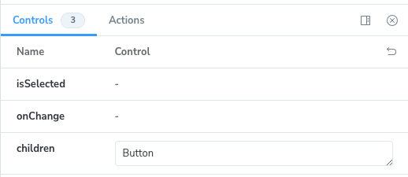

Storybookにおいて、Reactコンポーネントを使ったstoryを作成する際、単なるボタンのようなシンプルなコンポーネントであれば`component`プロパティに指定するだけで良い。

なおこの記事での解説は、Storybookのバージョン8.1.1に基づいたものである。

`Button.tsx`:

```tsx
import { MouseEvent, ReactNode } from 'react';

export interface ButtonProps {
  children?: ReactNode | undefined;
  onClick?: (event: MouseEvent<HTMLButtonElement>) => void;
}

export function Button({ children, onClick }: ButtonProps) {
  return (
    <button type="button" className="button" onClick={onClick}>
      {children}
    </button>
  );
}
```

`Button.stories.tsx`:

```tsx
import type { Meta, StoryObj } from '@storybook/react';
import { fn } from '@storybook/test';
import { Button } from './Button';

const meta = {
  title: 'Button',
  component: Button,
  args: {
    onClick: fn(),
  },
} satisfies Meta<typeof Button>;

export default meta;
type Story = StoryObj<typeof meta>;

export const Primary = {
  args: {
    children: 'Click me',
  },
} satisfies Story;
```

このように記述することで、コンポーネントにargsが渡されたうえで描画される。疑似コードで表現すれば次のようになる。

```tsx
function Primary() {
  const args = {
    children: 'Click me',
    onClick: fn(),
  };
  return <Button {...args} />;
}
```

一方、[controlledなコンポーネント](https://ja.react.dev/learn/sharing-state-between-components#controlled-and-uncontrolled-components)のstoryを作成する場合、そのコンポーネントの状態を外部から制御するための実装が必要になる。たとえば次のように。

```tsx
import { ReactNode, useCallback } from 'react';

export interface ToggleButtonProps {
  isSelected: boolean;
  children?: ReactNode | undefined;
  onChange: (isSelected: boolean) => void;
}

export function ToggleButton({ isSelected, children, onChange }: ToggleButtonProps) {
  const handleClick = useCallback(() => {
    onChange(!isSelected);
  }, [isSelected, onChange]);

  return (
    <button type="button" className="toggle-button" aria-pressed={isSelected} onClick={handleClick}>
      {children}
    </button>
  );
}
```

```tsx
import { useState } from 'react';

function Primary() {
  const [isSelected, setSelected] = useState(false);

  return (
    <ToggleButton isSelected={isSelected} onChange={setSelected}>
      Toogle
    </ToggleButton>
  );
}
```

## `render`メソッドの実装

これをstoryとして表現するには、`component`プロパティにコンポーネントを指定するだけでは不十分である。そこでこの描画方法をカスタマイズするために、`render`メソッドを併せて実装する必要がある。

```tsx
import type { Meta, StoryObj } from '@storybook/react';
import { fn } from '@storybook/test';
import { ToggleButton } from './ToggleButton';
import { useState } from 'react';

const meta = {
  title: 'ToggleButton',
  component: ToggleButton,
  args: {
    isSelected: false,
    onChange: fn(),
  },
  render: function Render(args) {
    const [isSelected, setSelected] = useState(false);
    return <ToggleButton {...args} isSelected={isSelected} onChange={setSelected} />;
  },
} satisfies Meta<typeof ToggleButton>;

export default meta;
type Story = StoryObj<typeof meta>;

export const Primary = {
  args: {
    children: 'Toggle',
  },
} satisfies Story;
```

metadata（`meta`）として指定された値はstoryに継承されるため、自ずとPrimary storyでは同じ`render`メソッドが再利用される。ちなみに`render`メソッドに`Render`という名前で関数宣言を記述しているのは、[eslint-plugin-react-hooksの`react-hooks/rules-of-hooks`ルールとの競合を回避するため](https://github.com/storybookjs/storybook/issues/21115)だ。

これによって、controlledなコンポーネントを操作可能なstoryをを作成できる。ただしこの実装では、Storybookのcontrolsからargsの値を制御できなくなってしまう。

import withoutUseArgsVideo from './assets/2024-07-08-controlled-component-in-storybook/without-useargs.mp4';

<figure>
  <video controls playsinline>
    <source src={withoutUseArgsVideo} />
  </video>
</figure>

## `useArgs`フックの使用

そのようなケースに対応すべく、argsの値を操作する[`useArgs`フック](https://storybook.js.org/docs/writing-stories/args#setting-args-from-within-a-story)がStorybookによって提供されている。これを利用することで次のような実装ができる。

```tsx
import { useArgs } from '@storybook/preview-api';
import type { Meta, StoryObj } from '@storybook/react';
import { fn } from '@storybook/test';
import { ToggleButton } from './ToggleButton';

const meta = {
  title: 'ToggleButton',
  component: ToggleButton,
  args: {
    isSelected: false,
    onChange: fn(),
  },
  render: function Render(args) {
    const [{ isSelected }, updateArgs] = useArgs();

    const handleChange = useCallback<ToggleButtonProps['onChange']>(
      (isSelected) => {
        updateArgs({ isSelected });
      },
      [updateArgs],
    );

    return <ToggleButton {...args} isSelected={isSelected} onChange={handleChange} />;
  },
} satisfies Meta<typeof ToggleButton>;
```

残る問題は、argsに設定されている`onChange`が呼び出されていないことである。`onChange`に渡されている[`fn()`はメソッドをモックするための機能](https://storybook.js.org/docs/essentials/actions#via-storybooktest-fn-spy-function)であり、[Jestにあるモック関数](https://jestjs.io/ja/docs/mock-functions)に似たものだ。これを用いることで、呼び出しのたびにStorybookのActionsパネルにログを表示したり、interaction testsにて呼び出し回数を調べたりできる。storyをより有用なものにするには、これが機能している方が良いだろう。

そんなわけで、このモックの呼び出しを有効にするには、次のように実装する。

```tsx
import { useArgs } from '@storybook/preview-api';
import type { Meta, StoryObj } from '@storybook/react';
import { fn } from '@storybook/test';
import { useCallback } from 'react';
import { ToggleButton, ToggleButtonProps } from './ToggleButton';

const meta = {
  title: 'ToggleButton',
  component: ToggleButton,
  args: {
    isSelected: false,
    onChange: fn(),
  },
  render: function Render(args) {
    const [{ isSelected }, updateArgs] = useArgs();

    const handleChange = useCallback<ToggleButtonProps['onChange']>(
      (...a) => {
        args.onChange(...a);
        const [isSelected] = a;
        updateArgs({ isSelected });
      },
      [args, updateArgs],
    );

    return <ToggleButton {...args} isSelected={isSelected} onChange={handleChange} />;
  },
} satisfies Meta<typeof ToggleButton>;
```

`onChange` propの呼び出しタイミングでargsの`onChange`メソッドと`updateArgs`フックが同時に呼び出されるようにする。それにより、argsの値を制御可能にしつつ、メソッドの呼び出しのたびにログが表示されるようにできる。

import withUseArgsVideo from './assets/2024-07-08-controlled-component-in-storybook/with-useargs.mp4';

<figure>
  <video controls playsinline>
    <source src={withUseArgsVideo} />
  </video>
</figure>

## `useArgs`フックの問題

しかし、`useArgs`フックには、[同一ページ内の複数箇所で呼び出されると正しく機能しないという不具合がある](https://github.com/storybookjs/storybook/issues/25380)。したがって、[Autodocs](https://storybook.js.org/docs/writing-docs/autodocs)によって生成されるドキュメントページなどではコンポーネントが操作不能になってしまうため、都合が悪い。

そのため、`useArgs`フックを使わないパターンの実装も紹介しておく。次のようになる。

```tsx
import type { Meta, StoryObj } from '@storybook/react';
import { fn } from '@storybook/test';
import { useCallback } from 'react';
import { ToggleButton, ToggleButtonProps } from './ToggleButton';

const meta = {
  title: 'ToggleButton',
  component: ToggleButton,
  tags: ['autodocs'],
  argTypes: {
    isSelected: {
      control: false,
    },
  },
  args: {
    isSelected: false,
    onChange: fn(),
  },
  render: function Render(args) {
    const [isSelected, setSelected] = useState(args.isSelected);

    const handleChange = useCallback<ToggleButtonProps['onChange']>(
      (...a) => {
        args.onChange(...a);
        setSelected(...a);
      },
      [args],
    );

    return <ToggleButton {...args} isSelected={isSelected} onChange={handleChange} />;
  },
} satisfies Meta<typeof ToggleButton>;
```

まず、`useArgs`フックの代わりに、前述と同様の`useState`フックを使うようにする。次に、argsに設定した`isSelected`を`useState`フックに渡す。これによって、argsから初期値を制御できるようになる。別のstoryを作成する際に次のように活用できる。

```tsx
export const SelectedByDefault = {
  args: {
    isSelected: true,
  },
} satisfies Story;
```

最後に、argTypesから`isSelected`の`control`を`false`にする。`useArgs`フックを使用しないとcontrolからの制御はできないので、control自体を非表示にしてしまう。

<figure></figure>

## controlledとuncontrolledの両方に対応したコンポーネントを作成する

とはいえ、そもそもコンポーネントがuncontrolledな状態にも対応できるように実装されていれば、通常利用する際にも便利だし、Storybookでの扱いも簡単になる。controlledとuncontrolledの両方に対応するコンポーネントを作成するには少しコツがいるが、既存のライブラリなどを利用すれば容易に実現できる。

[React Spectrum](https://react-spectrum.adobe.com/)で利用されている[@react-stately/utils](https://github.com/adobe/react-spectrum/tree/%40react-stately/utils%403.10.1/packages/%40react-stately/utils)では、そのための`useControlledState`フックが提供されており、次のような実装ができる。

```tsx
import { ReactNode, useCallback } from 'react';
import { useControlledState } from '@react-stately/utils';

export interface ToggleButtonProps {
  isSelected?: boolean;
  defaultSelected?: boolean;
  children?: ReactNode | undefined;
  onChange?: (isSelected: boolean) => void;
}

export function ToggleButton({ children, ...props }: ToggleButtonProps) {
  const [isSelected, setSelected] = useControlledState(
    props.isSelected,
    props.defaultSelected || false,
    props.onChange,
  );

  const handleClick = useCallback(() => {
    setSelected(!isSelected);
  }, [isSelected, setSelected]);

  return (
    <button type="button" className="toggle-button" aria-pressed={isSelected} onClick={handleClick}>
      {children}
    </button>
  );
}
```

{/* prettier-ignore */}[その他の使用例は同リポジトリから参照できる](<https://github.com/search?q=repo%3Aadobe%2Freact-spectrum%20useControlledState(&type=code>)。
