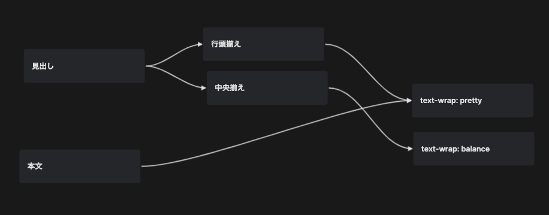
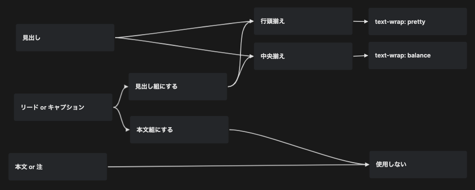
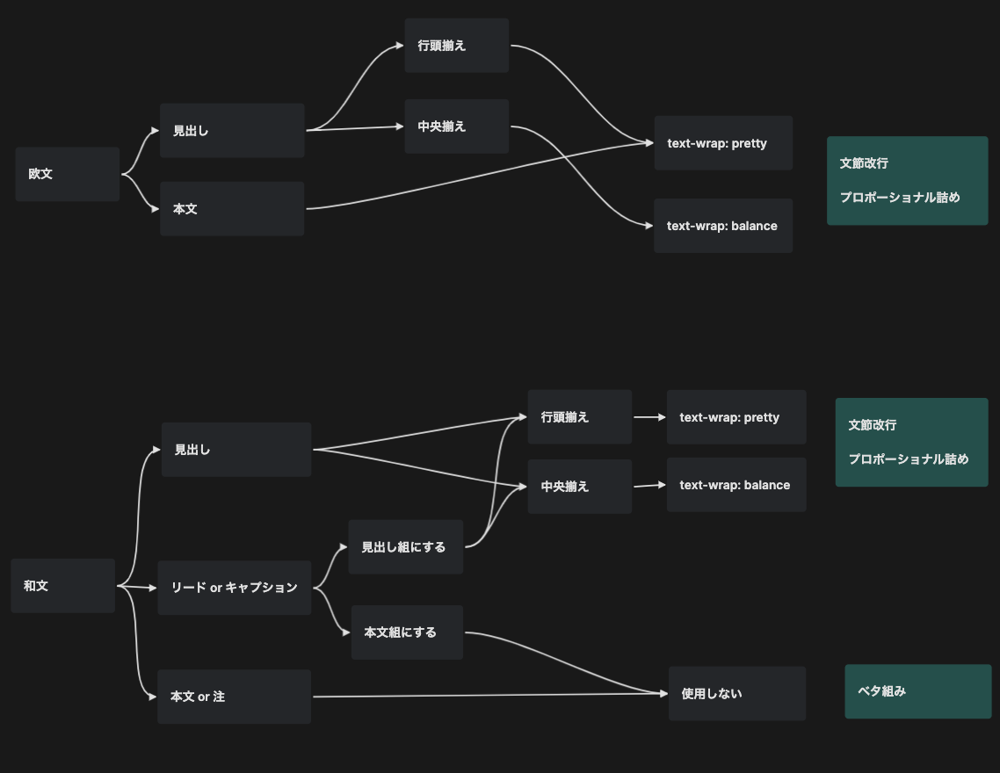

import { Image } from 'astro:assets';

CSSの`text-wrap`プロパティを使うと、テキストの行の折り返し方法を変更できる。`text-wrap: balance`を適用すると、適用しない場合と比べて次のように変化する。

<figure>
  
  <figcaption>
    [CSS text-wrap: balance  |  CSS and UI  |  Chrome for
    Developers](https://developer.chrome.com/docs/css-ui/css-text-wrap-balance)
  </figcaption>
</figure>

`text-wrap: balance`が適用された下の例では、すべての行の長さが均等になるように制御されている。

しかし正確に言えば、すべての行の長さが必ずしもまったく同じになるわけではない。文字の適切な折り返し位置を考慮した上で、おおよそ同じくらいの長さになるように分配される、というのが正しい。その際、一つの英単語の途中で行が分割されるようなことは通常起こらない。これは、英語では単語の区切りに空白文字を挟んで記述されるが（[わかち書き](https://ja.wikipedia.org/wiki/%E3%82%8F%E3%81%8B%E3%81%A1%E6%9B%B8%E3%81%8D)）、それが改行位置を決めるためのヒントとなるからである。

だが日本語の場合は都合が違う。改行できる位置に空白文字が挟まることがないため、文節や単語の途中でも関係なく改行が行われる仕様になっている。したがって、日本語にそのまま`text-wrap`プロパティを適用しても、英語の例と同じように好ましい結果にはならない。

## 文節区切りでの改行の実現

日本語においても適切な位置で改行がなされるようにするための手法はいくつかあるが、最も有望なのは`word-break: auto-phrase`を使うことであろう。これによって文節区切りの改行ができる。

```html
<html lang="ja">
  <style>
    h1 {
      word-break: auto-phrase;
    }
  </style>

  <h1>窓ぎわのトットちゃん</h1>
</html>
```

<figure>
  
  <figcaption>
    [Introducing four new international features in CSS  |  Blog  |  Chrome for
    Developers](https://developer.chrome.com/blog/css-i18n-features)
  </figcaption>
</figure>

改行位置を手動で調整するやり方もあるが、この例ではそれが自動的に行えるという点が先進的だ。現状、[このプロパティのサポート状況は十分ではない](https://caniuse.com/mdn-css_properties_word-break_auto-phrase)ため、必要に応じて[BudouX](https://developers-jp.googleblog.com/2023/09/budoux-adobe.html)の使用なども検討すると良いだろう。

## `balance`と`pretty`の使い分け

`text-wrap`プロパティの値としては`balance`が取り立てて紹介されがちだが、それ以上に有用な`pretty`という値もある。`balance`ではすべての行が同じくらいの長さになるように調整されるのに対して、`pretty`は最後の行が一つの単語だけで終わることを防ぐ。

<figure>
  <Image
    class="bg-white"
    src={import('./assets/2024-07-22-text-wrap-in-japanese/3.svg')}
    alt="段落の冒頭にwidowが、末尾にorphanが配置されており、それと比較するようにwidowやorphanのない例が並べられている"
  />
  <figcaption>
    [Widows & orphans – Fonts Knowledge - Google
    Fonts](https://fonts.google.com/knowledge/glossary/widows_orphans)
  </figcaption>
</figure>

欧文組版においては、最後の行に一つの単語だけが配置された状態を[widows and orphans](https://fonts.google.com/knowledge/glossary/widows_orphans)と呼び、テキストが読みにくくするとして避けられている。`pretty`はこの問題を解決するためのものである。

しかし、`pretty`は欧文の本文に適用するためのものであるようにしばしば紹介されるが、見出しなどでも有効に活用できる。見出しのレイアウトにおいては、中央揃えなら`balance`だが、行頭揃えなら`pretty`の方が見栄えがよくなるという個人的な経験則がある。なぜなら行頭揃えの見出しに`balance`を適用してしまうと、行の幅がその周辺のコンテンツよりもやけに狭く見えたり、行末方向にできた余白が不自然に大きく見えてしまったりしがちだ。これは日本語や英語に限らない一般的な現象である。

import _4Video from './assets/2024-07-22-text-wrap-in-japanese/4.mp4';

<figure>
  <video controls playsinline>
    <source src={_4Video} />
  </video>
  <figcaption>
    [CSS text-wrap: balance  |  CSS and UI  |  Chrome for
    Developers](https://developer.chrome.com/docs/css-ui/css-text-wrap-balance)
  </figcaption>
</figure>

代わりに`pretty`を適用することで、行の幅は自然なままで、折り返しが不自然になることは防ぐことができる。

## 日本語における適用方法

widows and orphansは欧文固有の問題であり、日本語では事情が異なる。日本語の本文は[ベタ組み](https://github.com/fontplus/web-typography-glossary/blob/master/terms/betagumi.md)にすることが原則であり、単語や文節に応じた折り返し位置の調整は行わないからだ。したがって同じ理由で、本文に`balance`を適用することもないはずだ。

そのため`text-wrap`プロパティの使いどころは、本文を除く見出し部分などが主となる。方針によっては、リードやキャプションなどを含むこともあるだろう。

ここまで説明してきて、適用方法がやや複雑になってきたので、フローチャートを用いて整理してみる。もっとも英語の場合は比較的シンプルである。

<figure>
  
  <figcaption>欧文のフローチャート</figcaption>
</figure>

行頭揃えの見出しには`text-wrap: pretty`、中央揃えの見出しには`text-wrap: balance`。本文は常に`text-wrap: pretty`。

日本語の場合、見出しと本文でテキストの組み方が異なるほか、リードやキャプションをどのように組むかも方針によるため、やや複雑になる。

<figure>
  
  <figcaption>和文のフローチャート</figcaption>
</figure>

行頭揃えの見出しには`text-wrap: pretty`、中央揃えの見出しには`text-wrap: balance`。「本文 or 注」には`text-wrap`プロパティは使用しない。「リード or キャプション」は、見出し組にするのなら見出しと同じ、本文組にするのなら本文と同じ。

また、見出し組では文節改行かつ[プロポーショナル](https://github.com/fontplus/web-typography-glossary/blob/master/terms/proportional-metrics.md)詰め、本文組ではベタ組みにするのが一般的であるため、フローチャートでは次のように整理できる。

<figure>
  
  <figcaption>欧文と和文のフローチャートに加えて、それぞれの方針を示したもの</figcaption>
</figure>

欧文は常に文節改行かつプロポーショナル詰めになる。和文の場合は、見出し組の場合は文節改行かつプロポーショナル詰めだが、本文組ではベタ組みになる。

ここまで述べてきた方針は、次のようなCSSとして表現できる。

```css
.heading {
  &:lang(en) {
    font-kerning: normal;
  }

  &:lang(ja) {
    font-kerning: normal;
    font-feature-settings: 'palt';
    word-break: auto-phrase;
  }
}

.heading.left {
  text-align: left;
  text-wrap: pretty;
}

.heading.center {
  text-align: center;
  text-wrap: balance;
}

.body {
  &:lang(en) {
    font-kerning: normal;
    text-wrap: pretty;
  }

  &:lang(ja) {
    font-kerning: none;
  }
}
```

## 参考文献

- [CSS text-wrap: balance  |  CSS and UI  |  Chrome for Developers](https://developer.chrome.com/docs/css-ui/css-text-wrap-balance)
- [CSS text-wrap: pretty  |  Blog  |  Chrome for Developers](https://developer.chrome.com/blog/css-text-wrap-pretty)
- [Introducing four new international features in CSS  |  Blog  |  Chrome for Developers](https://developer.chrome.com/blog/css-i18n-features)
- [ページネーションのための基本マニュアル](https://www.pot.co.jp/pagination)
- [Requirements for Japanese Text Layout - 日本語組版処理の要件（日本語版）](https://w3c.github.io/jlreq/)
- [Webタイポグラフィの基礎知識と実践](https://github.com/fontplus/web-typography-glossary)
