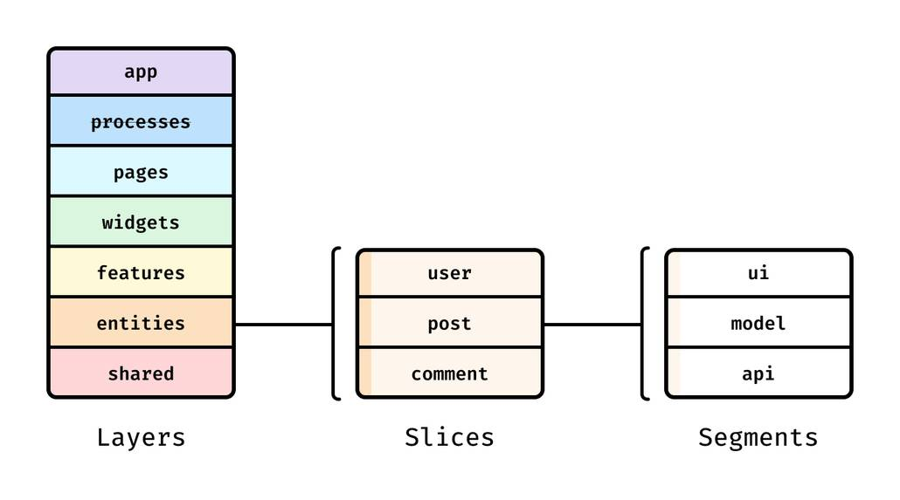

昨今、特にフロントエンドのアプリケーションにおいて、技術的な役割よりもフィーチャー（feature）を起点としてディレクトリを構成する（package by feature）というする考えが一般化しつつある。たとえば、技術的な役割を起点としたディレクトリ構成（package by layer）は次のようなものだ。

```sh
my-system
├─ controllers
│  ├─ user-controller.js
│  ├─ order-controller.js
│  ├─ payment-controller.js
├─ services
│  ├─ user-service.js
│  ├─ order-service.js
│  ├─ payment-service.js
├─ models
│  ├─ user-model.js
│  ├─ order-model.js
│  ├─ payment-model.js
```

<figcaption>
  &mdash;{' '}
  <cite>
    [Structure your solution by
    components](https://github.com/goldbergyoni/nodebestpractices/blob/master/sections/projectstructre/breakintcomponents.md)
  </cite>
</figcaption>

この代わりに、次のように構成すべきという考えである。

```sh
my-system
├─ apps (components)
│  ├─ orders
│  │ ├─ package.json
│  │ ├─ api
│  │ ├─ domain
│  │ ├─ data-access
│  ├─ users
│  ├─ payments
├─ libraries (generic cross-component functionality)
│  ├─ logger
│  ├─ authenticator
```

<figcaption>
  &mdash;{' '}
  <cite>
    [Structure your solution by
    components](https://github.com/goldbergyoni/nodebestpractices/blob/master/sections/projectstructre/breakintcomponents.md)
  </cite>
</figcaption>

同様の議論はこれまでにいくつもあって、方向性としては僕も賛同するが、それだけでは体系として不十分であるとも感じていた。フィーチャーの観点だけでアプリケーションが構成できるわけではないので、もっと踏み込んだ整理が必要だと思っていた。

そんなわけで、コミュニティにも同様のモチベーションがあってか、より包括的な議論も目にするようになってきた。しかしその中で僕が一際目を引かれたのが、[Feature-Sliced Design](https://feature-sliced.design/)という方法論だ。

Feature-Sliced Designにおいてもっとも特徴的なのが、「Layers」「Slices」「Segments」という階層構造になったスキームである。



<figcaption>
  &mdash; <cite>[Feature-Sliced Design](https://feature-sliced.design/)</cite>
</figcaption>

各Layersには決まった役割があり、その中にSlicesとSegmentsがそれぞれ入れ子になる。ただし、appとsharedにはSlicesを含めずにSegmentsが直接配置される。またSegmentsの名前としては、「ui」「api」「model」「lib」「config」が基本的な例として提案されている。

このスキームが秀逸な点は、大体のソースコードはこのLayersの中にすっきり分類できてしまうこと。加えて、SlicesとSegmentsがあることで、ディレクトリを跨いでも階層構造が同様になるよう統一できることだ。

そして、Feature-Sliced Designはフロントエンドのアプリケーション全般に適用できる方法論として紹介されている。その典型的な例としては、ReactやVue.jsなどを使ったSPAが当てはまるのだろうが、今回は、同様の問題を抱えがちなAstroを使ったプロジェクトに適用する例について考えてみたい。

というのも、Astroの[Project Structure](https://docs.astro.build/en/basics/project-structure/)として紹介されている構成は、まさに技術的な役割が起点になっている例である。これに従ってウェブサイトを構築していくと、たとえば次のような形になり得る。

```sh
src/
├── assets/
│   ├── about/
│   │   └── profile.jpg
│   ├── blog/
│   │   └── ad.jpg
│   ├── home/
│   │   └── hero.jpg
│   └── shared/
│       ├── favicon.ico
│       └── logo.svg
├── components/
│   ├── about/
│   │   └── Carousel.astro
│   ├── blog/
│   │   └── Sidebar.astro
│   ├── home/
│   │   └── Hero.astro
│   └── shared/
│       ├── Button.astro
│       └── Header.astro
├── content/
│   ├── blog/
│   │   └── hello.md
│   └── config.ts
├── layouts/
│   └── Layout.astro
├── pages/
│   ├── blog/
│   │   ├── [slug].astro
│   │   └── index.astro
│   ├── about.astro
│   └── index.astro
├── scripts/
│   └── main.ts
├── styles/
│   └── main.css
└── consts.ts
```

この構成はフレームワークによって強制されているわけではなく、多くは好みに応じて自由に変更できる。

この例では、「about」「blog」「home」などの共通する関心事に基づいたファイルがそれぞれのレイヤーに分散してしまって扱いづらいため、Feature-Sliced Designに基づいて再整理してみる。次のようになる。

```sh
src/
├── pages/
│   ├── blog/
│   │   ├── [slug].astro
│   │   └── index.astro
│   ├── about.astro
│   └── index.astro
├── content/
│   ├── blog/
│   │   └── hello.md
│   └── config.ts
├── app/
│   ├── layouts/
│   │   └── Layout.astro
│   ├── scripts/
│   │   └── main.ts
│   └── styles/
│       └── main.css
├── views/
│   ├── about/
│   │   ├── assets/
│   │   │   └── profile.jpg
│   │   └── ui/
│   │       └── Carousel.astro
│   └── home/
│       ├── assets/
│       │   └── hero.jpg
│       └── ui/
│           └── Hero.astro
├── widgets/
│   └── blog-sidebar/
│       ├── assets/
│       │   └── ad.jpg
│       └── ui/
│           └── index.astro
└── shared/
    ├── assets/
    │   ├── favicon.ico
    │   └── logo.svg
    ├── config/
    │   └── index.ts
    └── ui/
        ├── Button.astro
        └── Header.astro
```

このようにすると、おおむね関心事に基づいた構成にできたように思う。

前提として、Astro固有の制約によって`pages`のディレクトリ名は変更できないので、妥協してFeature-Sliced Designのレイヤー名の方を「views」に変更した。また可能であれば、`pages`と`content`はappレイヤーに含めたいが、これもAstroの制約により断念。

appレイヤーには、アプリケーションを動作させるための構成要素を含める。この例では、ページ全体のレイアウトを決める`layouts`や、グローバルスタイルやクライアントサイドで実行されるスクリプトを含めている。

続いて、特定のページでだけ使うAstroコンポーネントや画像ファイルなどが存在することはよくあるが、Astroの通常のディレクトリ構造ではそのためにちょうどいい置き場がない。そこで、viewsレイヤーがあることでコロケーションができるようになる。逆に、プロジェクト全体で共通して参照されているファイルについては、sharedレイヤーに配置することでその用途を明示することができる。

ページを跨いで共有されるAstroコンポーネントは一部widgetsレイヤーに含めている。汎用コンポーネントならsharedレイヤーに配置できるが、これは特定の機能に紐づいたものなのでここに配置した。

また、Astroを使うプロジェクトでは、SPAなどと違って、UIのソースコードが大部分を占めることになるだろう。そのため、レイヤーによってはセグメントの存在がやや冗長に感じられる。たとえば、viewsレイヤーにおいてはセグメントを省略する運用にしてもいいかもしれない。

加えて、Feature-Sliced Designでは画像ファイルの置き場は考慮されていないが、Astroの運用スタイルを踏まえて、assetsというセグメントを新たに作成した。

ここまでいろいろ述べてきたものの、Feature-Sliced Designを使った後者の例の方が必ずしも優れているとは限らない。特に小規模でシンプルなプロジェクトであればあるほど、前者の一般的な例の方が簡単で迷いづらいという見方もできる。しかし、特に規模が大きく複雑なプロジェクトにおいては、Feature-Sliced Designは検討に値するだろう。
