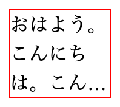
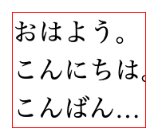
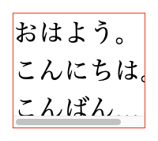
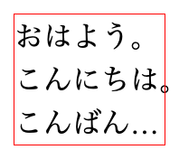

CSSの`-webkit-line-clamp`プロパティを使うとき、通常は`overflow: hidden`を併用することが多い。

<figure></figure>

```css
p {
  display: -webkit-box;
  -webkit-box-orient: vertical;
  -webkit-line-clamp: 3;
  overflow: hidden;
}
```

しかし、`hanging-punctuation`プロパティを併用する場合、`overflow: hidden`が指定されているとはみ出した役物が見切れてしまう。

<figure></figure>

```css
p {
  display: -webkit-box;
  -webkit-box-orient: vertical;
  -webkit-line-clamp: 3;
  overflow: hidden;
  hanging-punctuation: allow-end;
}
```

`-webkit-line-clamp`プロパティを機能させるには、本来は`overflow-y`プロパティを使うだけで十分だ。ただし`overflow-y: hidden`を指定すると、その副作用として横方向にスクロール可能な状態になってしまう。

<figure></figure>

```css
p {
  display: -webkit-box;
  -webkit-box-orient: vertical;
  -webkit-line-clamp: 3;
  overflow-y: hidden;
  hanging-punctuation: allow-end;
}
```

この問題を解決するのが、`clip`である。`clip`を使うと、単方向の切り取りを実現しつつ、もう一方はスクロール不能な状態のままにできる。

<figure></figure>

```css
p {
  display: -webkit-box;
  -webkit-box-orient: vertical;
  -webkit-line-clamp: 3;
  overflow-y: clip;
  hanging-punctuation: allow-end;
}
```

`hanging-punctuation`プロパティにかぎらず、横方向にコンテンツのはみ出しが発生する場面においては有効だろう。
