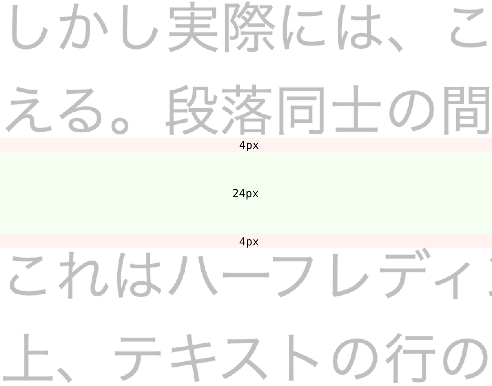

垂直方向に複数の段落と画像が並ぶとき、間隔を均一にしたければ、それぞれ同じ大きさの`margin`プロパティを適用するだろう。

```html
<p><!-- ... --></p>
<p><!-- ... --></p>
<figure><!-- ... --></figure>
<p><!-- ... --></p>
```

```css
:root {
  --space-default: 1rlh;
}

p {
  margin-block-start: var(--space-default);
  margin-block-end: 0;
}

figure {
  margin-block-start: var(--space-default);
  margin-block-end: 0;
}
```

{/* prettier-ignore */}
<p class="codepen" data-height="900" data-slug-hash="zxOPZop" data-pen-title="Untitled" data-user="yuheiy" style="height: 300px; box-sizing: border-box; display: flex; align-items: center; justify-content: center; border: 2px solid; margin: 1em 0; padding: 1em;">
  <span>See the Pen <a href="https://codepen.io/yuheiy/pen/zxOPZop">
  Untitled</a> by Yuhei Yasuda (<a href="https://codepen.io/yuheiy">@yuheiy</a>)
  on <a href="https://codepen.io">CodePen</a>.</span>
</p>
<script async src="https://public.codepenassets.com/embed/index.js"></script>

しかし実際には、このようにすると段落と画像の間隔がやや詰まって見える。段落同士の間隔に比べて、段落と画像の間隔が少し狭く感じる。

これはハーフレディングが原因の現象だ。`line-height`プロパティの仕様上、テキストの行の上端と下端には余白が設けられる。たとえば`font-size`プロパティが`16px`で、`line-height`プロパティが`24px`であれば、上下に`4px`の余白ができる。

```
(24px - 16px) / 2 = 4px
```

段落が連続する場合、`margin`プロパティの値に加えてこのハーフレディングを加えた分の大きさの余白ができる。前の段落の下端のハーフレディングと、後の段落の上端のハーフレディングが組み合わされるため、ハーフレディングの2倍分の余白が含まれることになる。`margin`プロパティが`24px`で、ハーフレディングが`4px`であれば、大きさは合計で`32px`になる。

<figure></figure>

```
4px + 24px + 4px = 32px
```

一方、段落の直後に画像が続く場合、片方のハーフレディングしか含まれない。したがって、余白の大きさはその分小さい`28px`になる。

<figure></figure>

```
4px + 24px = 28px
```

段落と画像の間隔が詰まって見えるのはこのような理由である。

この問題を解決するには、画像の周囲にハーフレディングの分を余分に含めた余白を設定するとよい。ハーフレディングの値は`(1rlh - 1rem) / 2`で算出できるので、これを通常の`margin`プロパティの値と足し合わせる。

```css
:root {
  --space-rect: calc(var(--space-default) + (1rlh - 1rem) / 2);
}

figure {
  margin-block-start: var(--space-rect);
  margin-block-end: var(--space-rect);
}
```

これによって、画像の前後にも段落の間と同じ間隔が適用されるようになる。

便宜上、ここまでは画像を例に解説したが、そのほかの要素においても同様の問題が生じることがある。たとえば、背景色がついていたりボーダーで囲われていたりして、周囲との境界がはっきりしている要素。このサイトで言えば、`hr`要素、`pre`要素、`table`要素などだ。これらについても同様に`margin`プロパティを設定する。

```css
hr {
  margin-block-start: var(--space-rect);
  margin-block-end: var(--space-rect);
}

pre {
  margin-block-start: var(--space-rect);
  margin-block-end: var(--space-rect);
}

table {
  margin-block-start: var(--space-rect);
  margin-block-end: var(--space-rect);
}
```

ただし、これらの要素が連続して配置されると、やはりほかより狭い間隔になってしまう。`--space-rect`には片方のハーフレディングの分の余白しか含まれていないが、これらの要素が連続した際にはハーフレディングの余白は存在しないため、ほかと均一にするには両方のハーフレディングの分の余白を含める必要がある。そこで、要素が連続した際には`margin`プロパティを上書きすることで余白を均一にすることができる。

```css
:root {
  --space-rect2: calc(var(--space-default) + 1rlh - 1rem);
}

:is(hr, pre, figure, table) {
  & + & {
    margin-block-start: var(--space-rect2);
  }
}
```

---

この記事での解説は、[Hail2uのCSS](https://github.com/hail2u/hail2u.net/blob/v9.33.5/static/css/index.css)で採用されている手法を参考にしたものである。
