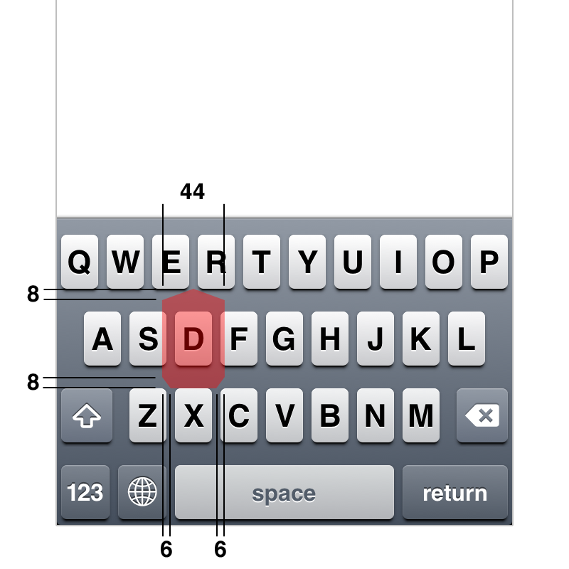

import SmartIframe from '../../../components/SmartIframe.astro';

この記事は、「[Web UI 実装勉強会 #1](https://ui-devs.connpass.com/event/364448/)」での同タイトルの発表をもとにしたものです。

## ターゲットエリアを広げる工夫

リンクやボタンなどのUI要素を押したときに反応する領域のことをターゲットエリアと呼びます。素朴に実装すれば、その要素の視覚的なサイズがそのままターゲットエリアになります。

しかし場合によっては、これではあまり使い勝手が良くならないことがあります。要素自体のサイズが小さいと押すことができる領域も狭くなるので、その分正確性が求められて押しづらくなります。

<figure>
  <SmartIframe src="/2025/click-friendly-target-areas/navbar-bad.html" />
</figure>

そういうときには、視覚的なサイズよりも余分にターゲットエリアを広げるテクニックを使います。`padding`プロパティを使って要素自体のサイズを広げつつ、レイアウトが崩れないように同じ大きさのネガティブマージンを適用します。

<figure>
  <SmartIframe src="/2025/click-friendly-target-areas/navbar-good.html" />
</figure>

```css
a {
  margin: -4px;
  padding: 4px;
}
```

一方、プレーンなテキストリンクと違って、背景色などがついたボタンなどの場合、`padding`プロパティのテクニックは少し使いづらいです。

<figure>
  <SmartIframe src="/2025/click-friendly-target-areas/button-bad.html" />
</figure>

そのような場合は、擬似要素を使って相対的な位置指定をするのが簡単です。

<figure>
  <SmartIframe src="/2025/click-friendly-target-areas/button-good.html" />
</figure>

```css
button {
  position: relative;

  &::before {
    position: absolute;
    inset: -6px;
    content: '';
  }
}
```

## iOSにおけるターゲットエリア

このような工夫は僕が独自に考えたものではなくて、昔からさまざまな実装に採用されています。たとえばiOSにおいては、ナビゲーションバーのボタンではボタン自体の大きさよりも大きなターゲットエリアが確保されているそうです（参考: [iPhone の当たり判定を検証した](https://www.sociomedia.co.jp/4152)）。

<figure>
  
  <figcaption>
    — [ソシオメディア | iPhone の当たり判定を検証した](https://www.sociomedia.co.jp/4152)
  </figcaption>
</figure>

興味深いのは、キーボードのターゲットエリアはタイピングの途中で動的に変化するようになっていることです。ユーザーが一文字タイプするたびに、次にくる文字を予測して、キーごとに重み付けがされているのです。

QWERTYキーボードのキーの幅はかなり狭く、通常時のターゲットエリアのサイズは32ptです。

<figure>
  
  <figcaption>
    — [ソシオメディア | iPhone の当たり判定を検証した](https://www.sociomedia.co.jp/4152)
  </figcaption>
</figure>

しかし、「WORLD」という単語を打つつもりで「WORL」までをタイプすると、次に来る可能性が高いDキーのターゲットエリアが広がって44ptになるそうです。

<figure>
  
  <figcaption>
    — [ソシオメディア | iPhone の当たり判定を検証した](https://www.sociomedia.co.jp/4152)
  </figcaption>
</figure>

このような高度な実装をしてまでも、ターゲットエリアの大きさを確保することが重要なのだと思います。

## ターゲットサイズの基準

とはいえ、現実的にどこまで大きくすればいいかについては、基準がなければ判断が難しいものです。

一つの目安として、WCAGにはターゲットサイズに関する達成基準が二つあります。そのなかで、最低限の基準としては24px × 24px、より高度な基準としては44px × 44pxを満たすことが定められています。また、Human Interface Guidelinesでは44pt × 44ptが基準になっています。

| ガイドライン                                                                                                       | サイズ      |
| ------------------------------------------------------------------------------------------------------------------ | ----------- |
| [WCAG SC 2.5.8](https://waic.jp/translations/WCAG22/Understanding/target-size-minimum.html)                        | 24px × 24px |
| [WCAG SC 2.5.5](https://waic.jp/translations/WCAG22/Understanding/target-size-enhanced.html)                       | 44px × 44px |
| [Human Interface Guidelines](https://developer.apple.com/design/human-interface-guidelines/accessibility#Mobility) | 44pt × 44pt |

これを踏まえて、24px × 24pxの大きさは最低限確保するようにしつつ、状況に応じて44px × 44pxも達成することを目指すと考えるとよいでしょう。

## 押せそうな場所は押せるようにする

また別の例として、本来押せそうに見えるのに押せないようになっている実装をたまに見かけることがあります。わかりやすい例としては、チェックボックスです。チェックボタンを押せば反応するけど、そのラベルを押しても反応しないようになっていることがあります。

<figure>
  <SmartIframe src="/2025/click-friendly-target-areas/checkbox-bad.html" />
</figure>

```html
<input type="checkbox" /> Do you need animations?
```

慣習的に考えても、チェックボックスはラベルまで含めて押せるようになっているべきです。実装としては、`label`要素で囲えばそれを実現できます。

<figure>
  <SmartIframe src="/2025/click-friendly-target-areas/checkbox-good.html" />
</figure>

```html
<label><input type="checkbox" /> Do you need animations?</label>
```

もう少し複雑な例として、アイコンと`input`要素の組み合わせからなる検索フィールドの実装についても考えてみます。こうしたUI要素は、マークアップとして見れば複数の要素を組み合わせた複合的なコンポーネントですが、ユーザーにとっては単一の入力フィールドです。このことを意識せずに、見た目だけを再現するつもりで実装すると、限られたエリアしか押すことができない次のような実装になってしまいます。

<figure>
  <SmartIframe src="/2025/click-friendly-target-areas/search-field-bad.html" />
</figure>

```html
<div class="search-field">
  <svg>...</svg>
  <input type="search" />
</div>
```

```css
.search-field {
  display: inline-flex;
  gap: 8px;
  border: 1px solid;
  background-color: white;
  padding: 4px 8px;

  input {
    border: 0;
    background-color: transparent;
  }
}
```

これは実装モデルに引っ張られてしまったがゆえの失敗です。理想的には、複数の要素の組み合わせであることをユーザーに意識させないような実装になっているべきです。つまり、普通の入力フィールドと同じようにどこを押してもフォーカスできるようになっているのが良いでしょう。

<figure>
  <SmartIframe src="/2025/click-friendly-target-areas/search-field-good.html" />
</figure>

```html
<div class="search-field">
  <svg>...</svg>
  <input type="search" />
</div>
```

```css
.search-field {
  position: relative;

  svg {
    position: absolute;
    margin: 4px 8px;
    pointer-events: none;
  }

  input {
    border: 1px solid;
    background-color: white;
    padding: 8px 8px 8px 40px;
  }
}
```

## 無闇に広げすぎない

一方、ターゲットエリアは必ずしも広ければ広いほど良いわけでもありません。

リスト項目が縦にスタックしたようなナビゲーションがあるとします。そのなかのリンクに`display: block`を適用すると、コンテナサイズいっぱいまでターゲットエリアが拡張されます。

<figure>
  <SmartIframe src="/2025/click-friendly-target-areas/menu-bad.html" />
</figure>

```css
a {
  display: block;
}
```

一見、ターゲットエリアが広がって良いことのように思えますが、別の側面から見れば、対象の要素と関係なさそうな場所を押しても反応してしまうことになります。すると、「リンクを押すつもりはないのに、意図せず押したことになってしまった」ということが起こり得ます。

この改善例としては、`width: fit-content`などを適用して必要以上に伸び広がらないように制御するのが良いでしょう。また`padding`のテクニックも併用して、周辺に少しだけ広げる工夫もするとなお良いです。

<figure>
  <SmartIframe src="/2025/click-friendly-target-areas/menu-good.html" />
</figure>

```css
a {
  display: block;
  margin-inline: -12px;
  padding-inline: 12px;
  width: fit-content;
}
```

似たような例として、入力フィールドのラベルのターゲットエリアがあります。レイアウトの都合で`display: block`を適用することはよくありますが、その場合も同様の問題が起こります。

<figure>
  <SmartIframe src="/2025/click-friendly-target-areas/label-bad.html" />
</figure>

```css
label {
  display: block;
}
```

こうしたときにも、`width: fit-content`などを適用して範囲を制御するのがよいと思います。

<figure>
  <SmartIframe src="/2025/click-friendly-target-areas/label-good.html" />
</figure>

```css
label {
  display: block;
  width: fit-content;
}
```

## 今回の勉強会についての余談

今回のこの勉強会に参加したのは、開催者の[Katashinさん](https://x.com/ktsn)が以前投稿していた「[UI の実装に関する勉強会をやりたい](https://sizu.me/ktsn/posts/tsuuvsk35ed1)」という問題意識に共感したからだ。

<figure>
  > 最近また勉強会に参加するようになって色々と行っているうちに、ふと UI の実装に関する勉強会ってほとんどないなと思った。UI デザインはちらほら見かけるけど、UI 実装は見かけない。
  >
  > たいてい TypeScript、Vue、Biome みたいに言語、ライブラリ、ツールをテーマにしたものが多くて、UI を切り口にしているものを見かけない。もちろん、他のテーマの勉強会で UI を絡めた話がある場合もあるけど、UI 実装をテーマに据えた会でいろいろな話を聞いてみたい。

  <figcaption>
    — [UI の実装に関する勉強会をやりたい](https://sizu.me/ktsn/posts/tsuuvsk35ed1)
  </figcaption>
</figure>

同日に投稿されていた、[橋本麦さん](https://x.com/_baku89)の「[Jul 24, 2025: 詰め方の問題](https://scrapbox.io/glisp/Jul_24,_2025:_%E8%A9%B0%E3%82%81%E6%96%B9%E3%81%AE%E5%95%8F%E9%A1%8C)」にも感化された部分がある。

<figure>
  > 結局のところ、ぼくが気になっているのは、ものごとを媒介する関係性や構造ばかりが語られて、肝心のそれ自体——グラフィックであれ、アニメーションであれ、画面に現れる[表層](https://scrapbox.io/glisp/%E8%A1%A8%E5%B1%A4)的な“何か”そのものが、語られることなくどこかへ押しやられていることだ。もちろん、それをめぐる構造、物語性、組織や経済がどう影響しているかは、無視できるわけじゃない。でも、だからといってそれ「ばかり」に意識を向けるのは、[Lev
  Manovich](https://scrapbox.io/glisp/Lev_Manovich)が言うように、画面の「出力」だけを見てその背後にあるプログラムのアーキテクチャを問わないのと同じくらい片手落ちだ。それは生存戦略として間違っちゃいないにせよ、グラフィックデザイン文化としては貧しいと思う。

  <figcaption>
    — [Jul 24, 2025: 詰め方の問題](https://scrapbox.io/glisp/Jul_24,_2025:_%E8%A9%B0%E3%82%81%E6%96%B9%E3%81%AE%E5%95%8F%E9%A1%8C)
  </figcaption>
</figure>

個人的には、自分の近辺のコミュニティで、UIそのものについて語られる機会が少ないと思っていた。みんなある程度のキャリアを経ると、そういう手前の話は「通過済み」のものとして理解されてしまうのかもしれない。けれど僕にとっては最初と変わらず喫緊の問題だし、いつまで経っても、世の中に新たな出来の悪いUIが生み出され続けていることに辟易としている。

また、開発者のUIに対する無頓着さについても気になっていた。開発者としてコードを書いていると、何かを形にするための方法にばかり視点が向いてしまうことがある。しかしその方法としての妥当性の前に、形にしようとしているそのものに目を向けることが重要だし、それに付き従って構造ができるのだ。ダメなものの構造を強化しても仕方がない。これは分業体制下において抜け落ちがちな意識かもしれない。

だからこそ、UIのデザイン意図と実装が交差するような話をしたいと思った。本来デザインと実装の垣根はないが、何かしらの肩書きのもとで植え付けられた意識が、そこに壁を作っている。そうしたナンセンスな区分けにとらわれずに、それそのものについてフラットな視点で考えられるようにしたい。

こういう考え方がもっと広められると良いし、そのような機会があれば連帯したい。次回も開催されるようなので参加したいと思う。

あと、久しぶりに会った[terkelさん](https://x.com/terkel)に「相変わらずfundamentalな話してる」と評されたのがうれしかった。
