import { Image } from 'astro:assets';

「[PLAID Designer’s Advent Calendar 2025](https://adventar.org/calendars/11716)」の1日目の記事です。

---

レスポンシブデザインでウェブサイトの制作をする場合、デザイナーがモバイル幅とデスクトップ幅のデザインカンプを作成し、開発者がそれをもとに実装するというワークフローが一般的である。このとき決まって問題になるのが、デザインカンプとして定義されていない、モバイル幅とデスクトップ幅の「間」（もしくはその区間の外の幅）をどのように実装するかということだ。

デザインカンプを作成する際は、標準的なビューポートとして決まったモバイル幅やデスクトップ幅に向けてデザインするだろう。しかし実際のユーザー環境は極めて多様で、[Set Studioの調査](https://viewports.fyi/)によれば12万件のデータから2300種類以上のビューポートのサイズが観測されたと言う。筆者がそのデータをもとに、典型的なデザインカンプの幅と一致するものを調べてみたところ、375pxは11.9%、1440pxはわずか1.15%だった。さらに、ユーザーは必ずしもブラウザを画面いっぱいに表示しているわけではなく、多くは好みの大きさにリサイズされているはずであり、昨今では[iPadでさえ複数ウインドウの表示が可能](https://support.apple.com/ja-jp/guide/ipad/ipad08c9970c/ipados)だ。

この状況において、標準的なビューポートを定義することには無理がある。だからこそ、デザインカンプとして仮定された幅での見え方ばかりを重視するよりも、モバイル幅からデスクトップ幅までの幅広い範囲全体を分け隔てなく設計すると考えるべきだ。

基本的に多くのデザインでは、モバイル幅では狭い描画領域に応じたシンプルなレイアウトで要素のサイズは小さく、デスクトップ幅では広い描画領域に応じた複雑なレイアウトで要素のサイズは大きくなる傾向がある。したがって、間の幅ではそれらの中間くらいになるようにデザインするのが適当と考えられる。

しかし、その中間くらいのデザインをするには思いのほか手間がかかる。デスクトップ幅のデザインとモバイル幅のデザインを見比べながら、レイアウトや文字サイズ、余白などがちょうどよいところに落ち着くよう、周囲の要素とのバランスも鑑みながら一つひとつ調整していく作業はそれなりに大変なものだ。また、細かくブレークポイントを設けて個別にスタイルを上書きしていくことで、CSSの保守性も悪化してしまう。さらに複数の開発者が携わると、中間のデザインのバランス感覚や実装方式にブレが生じて問題が複雑化する。

こうした諸問題は、個別のスタイル調整のたびに人の手を介在させなければならないことに由来して生じる。だがCSSの機能をうまく利用すれば、ブレークポイントの個別の調整なしに自ずとレスポンシブなレイアウトを構築できる。そして前述のような問題もかなり軽減されるのだ。今回は、そのために効果的なCSSの手法や考え方について紹介する。

## フルイドタイポグラフィ

ビューポートの幅に応じて文字サイズを調整したいとき、まず思いつく手法は、メディアクエリを使ってブレークポイントごとに上書きしていくことだろう。このように実装すると、ブラウザをリサイズしてブレークポイントに達するたびに、レイアウトがガクンと切り替わるような見え方になる。

```css
h1 {
  font-size: 2rem;
}

@media (min-width: 768px) {
  h1 {
    font-size: 3rem;
  }
}

@media (min-width: 1280px) {
  h1 {
    font-size: 4rem;
  }
}

@media (min-width: 1600px) {
  h1 {
    font-size: 5rem;
  }
}
```

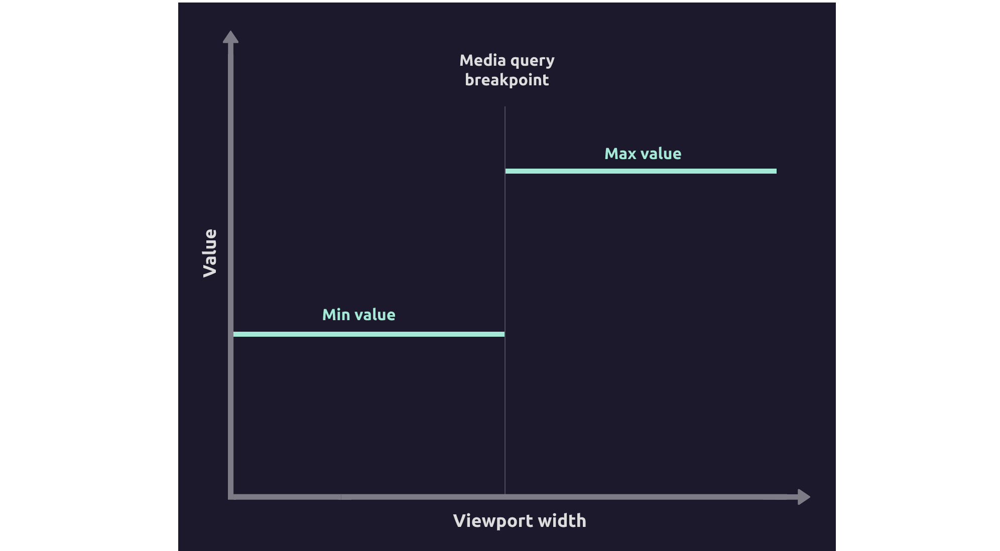

<figcaption>
  —{' '}
  <cite>
    [Modern Fluid Typography Using CSS Clamp — Smashing
    Magazine](https://www.smashingmagazine.com/2022/01/modern-fluid-typography-css-clamp/)
  </cite>
</figcaption>

この手法には大きく2つの問題がある。

一つは、ブレークポイントごとにCSSを上書きする作業が必要なこと。一つの要素だけ調整するのなら簡単だが、実際はサイト全体に渡るあらゆる要素においてこの作業をすることになる。保守性の観点でも好ましくない。

もう一つは、ブレークポイントに近づくにつれて見栄えが悪くなってしまうこと。モバイル幅からデスクトップ幅にかけてCSSを記述する場合、ビューポートの幅が広がることにともなって文字サイズの調整が必要になるたび、ブレークポイントを設けてCSSを上書きすることになる。しかし現実的な問題として、ブレークポイントを無数に設けるわけにはいかないので、見た目の理想状態から離れて許容できる限界に達するまでタイミングを間引いてから上書きするという判断になるがちだ。その結果、ブレークポイントの付近ではよい見た目にならない傾向がある。

こうした問題の解決策として、文字サイズなどの値を自動調整する手法がある。CSSのvw単位などを駆使して、指定した最小値から最大値までをビューポートの幅に応じて線形に変化させる計算式を使った仕組みだ。これはフルイドタイポグラフィ（fluid typography）、もしくは単に文字を指してフルイドタイプ（fluid type）と呼ばれる（参考: [Fluid Typography | CSS-Tricks](https://css-tricks.com/snippets/css/fluid-typography/)）。

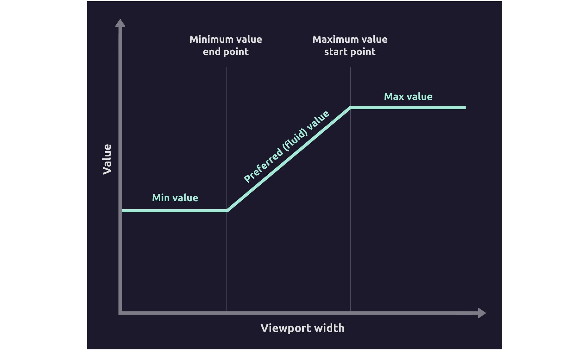

<figcaption>
  —{' '}
  <cite>
    [Modern Fluid Typography Using CSS Clamp — Smashing
    Magazine](https://www.smashingmagazine.com/2022/01/modern-fluid-typography-css-clamp/)
  </cite>
</figcaption>

実装例はいくつかあるが、よりネイティブなアプローチとして、CSSの`@function`を使ったものを紹介しておこう。

{/* prettier-ignore */}
```css
/**
Creates fluid typography that scales with viewport.

NOTE: This function is mathematically equivalent to `--responsive-value()` but optimized for typography. Use this for `font-size`, `--responsive-value()` for other properties.

@param {Length} --min - Minimum font size.
@param {Length} --max - Maximum font size.
@param {Length} --min-viewport - Minimum viewport width.
@param {Length} --max-viewport - Maximum viewport width.
@returns {Length} Fluid font size.
@example font-size: --fluid-type(16px, 24px, 320px, 1280px);
*/
@function --fluid-type(--min, --max, --min-viewport: 320px, --max-viewport: 1280px) {
	--slope: calc((var(--max) - var(--min)) / (var(--max-viewport) - var(--min-viewport)));
	--intercept: calc(var(--min) - var(--slope) * var(--min-viewport));
	result: clamp(var(--min), calc(var(--intercept) + var(--slope) * 100vw), var(--max));
}
```

<figcaption>
  —{' '}
  <cite>
    [css-extras/index.css at v0.4.0 ·
    sindresorhus/css-extras](https://github.com/sindresorhus/css-extras/blob/v0.4.0/index.css#L295-L311)
  </cite>
</figcaption>

これによって、前述のブレークポイントを使った例は次のように置き換えられる。

```css
h1 {
  font-size: --fluid-type(2rem, 5rem);
}
```

このフルイドタイポグラフィの良いところは、今まで通りのワークフローをほとんど変えることなく取り入れられることだ。モバイル幅の値を最小値に、デスクトップ幅の値を最大値にそのまま指定することで、ブレークポイントベースの実装をほぼ機械的に置き換えられる。

そしてフルイドタイポグラフィは、文字サイズだけではなく、余白や要素の幅・高さなどにも併せて適用することでより効力を発揮する。ブレークポイントベースでの実装と同じく、全体のバランスが問題であり、そのためにはさまざまな要素を同時に調整することが肝心だからだ。

注意点として、モバイル幅とデスクトップ幅で異なったあしらいが施されている場合、見たままの通りに最小値と最大値を指定して実装できないことがある。もしくは、間の幅に合わせてどちらでもないレイアウトをせざるを得ない場合もそうだ。そうした場合は、単に静的な値を指定するか、いい塩梅の変化になるように値を検証して指定する必要がある。

前述の実装例は、好みのツールに合わせて書き換えるとよい。[`@function`の実装状況はまだ不十分なこと](https://developer.mozilla.org/en-US/docs/Web/CSS/Reference/At-rules/@function#browser_compatibility)に加え、[Firefoxでは異なる単位同士の乗算や除算に対応しておらず](https://github.com/web-platform-tests/interop/issues/513)、そのままでは使用できないからだ。僕の場合はTailwind CSSを使うことが多いので、[独自のPostCSSプラグイン作成したうえで独自関数を導入している](https://github.com/yuheiy/sdenv/blob/main/postcss.config.ts)。これはTailwind CSSで次のように使用できる。

```html
<h1 class="text-[length:--fluid(2rem,5rem)]"><!-- ... --></h1>
```

もしくは次のようにしてもよい。

```css
@theme {
  --text-h1: --fluid(2rem, 5rem);
}
```

```html
<h1 class="text-h1"><!-- ... --></h1>
```

## Utopia

フルイドタイポグラフィ自体は有用であるものの、しかしデザインのためのシステムとしてはこれだけでは不完全とも言える。レスポンシブデザインにおける値の指定は、単一の要素のみではなく、複数要素の組み合わせからなる問題だと考えると、その組み合わせをどのように生成すべきかが次の問いになるからである。

具体的に言えば、レスポンシブデザインを前提としたタイプスケールや余白のバリエーションをどう設計するか。もしこれらを無秩序に設定すると、全体の統一感がなくなったり、ヒエラルキーを適切に表現できなくなったりしてしまう。だから、パターンをどこかのタイミングで決めて、その全体ルールに則って個別デザインを進めるのが定石だ。


<figcaption>
  —{' '}
  <cite>
    [The type system - Material
    Design](https://m2.material.io/design/typography/the-type-system.html)
  </cite>
</figcaption>

一方、レスポンシブデザインを前提とした方法論はあまり普及していないように思う。モバイル幅とデスクトップ幅でバリエーションは別々に定義するのか、それとも共通のセットが先にあってから幅によって値だけが変化するのか。モバイル幅での値とデスクトップ幅での値の比率はどのようになるのか。

そこで、レスポンシブデザインのための体系的な方法論として生まれたのが[Utopia](https://utopia.fyi/)である。Utopiaが提供するのは、タイプスケールと余白のバリエーションを生成するための2つのジェネレーターだ。

Utopiaの狙いの一つは、デザイナーと開発者が同じ意図に基づいて制作すること。デザイナーはこれによって生成されたタイプスケールと余白を使ってデザインし、開発者はそうして指定された値をそのままコードに適用する。

これらはフルイドタイポグラフィと同様の仕組みに基づいている。モバイル幅とデスクトップ幅を指定したうえで、それぞれのジェネレーターに固有の設定をすることで、そこからなるスケールとCSSが出力される。

タイプスケールには[モジュラースケール](https://www.modularscale.com/)が採用されており、基準値と比率をそれぞれ幅ごとに指定する。

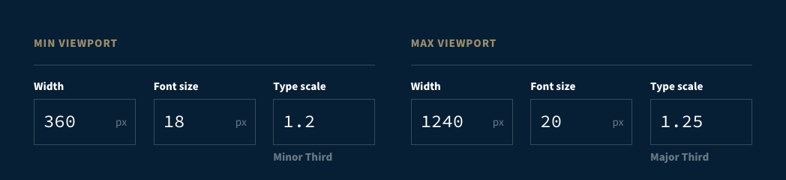

<figcaption>
  — <cite>[Fluid type scale calculator | Utopia](https://utopia.fyi/type/calculator/)</cite>
</figcaption>

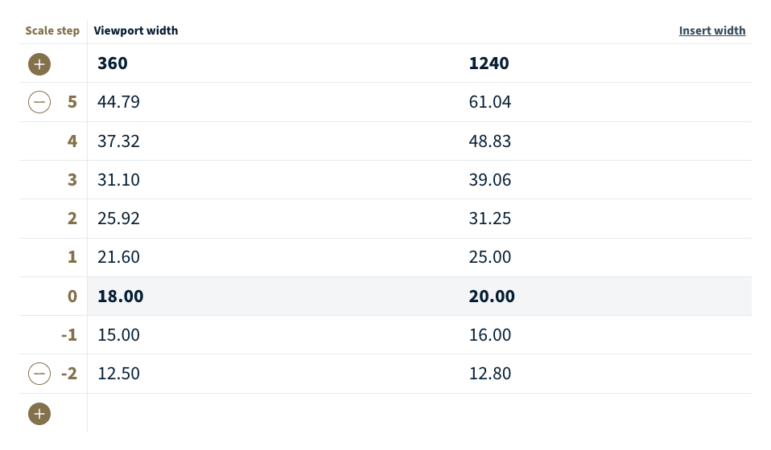

<figcaption>
  — <cite>[Fluid type scale calculator | Utopia](https://utopia.fyi/type/calculator/)</cite>
</figcaption>

ステップごとの値を視覚化すると次のようになる。


<figcaption>
  —{' '}
  <cite>
    [Designing with fluid type scales |
    Utopia](https://utopia.fyi/blog/designing-with-fluid-type-scales)
  </cite>
</figcaption>

余白はもっと単純で、単なる基準値の乗算になっている。

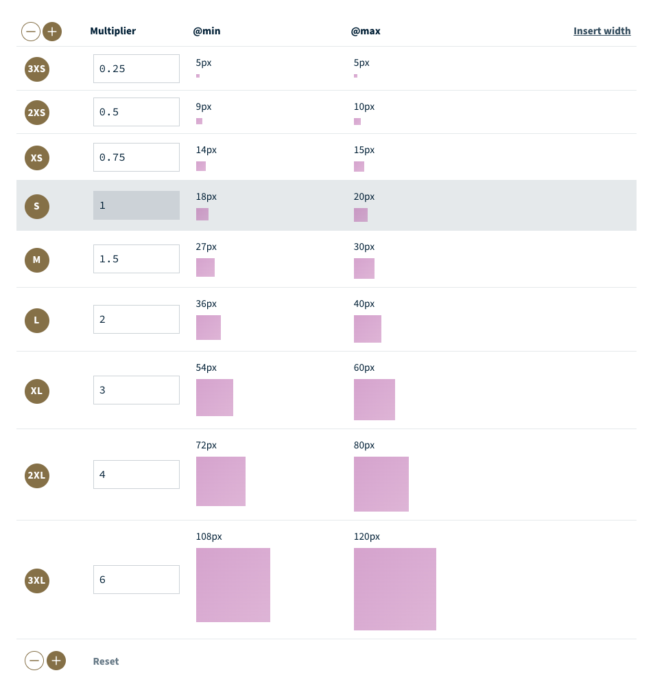

<figcaption>
  — <cite>[Fluid space calculator | Utopia](https://utopia.fyi/space/calculator/)</cite>
</figcaption>

こうして生成されたタイプスケールと余白を使って、まずデザイナーがデザインカンプを作成する。「タイトルはステップ2」「その周囲の余白はS」というように、パレットから値を選ぶようにしてデザインする。開発者がそれを実装すると、間の幅も含めた全体が自ずと出来上がる。

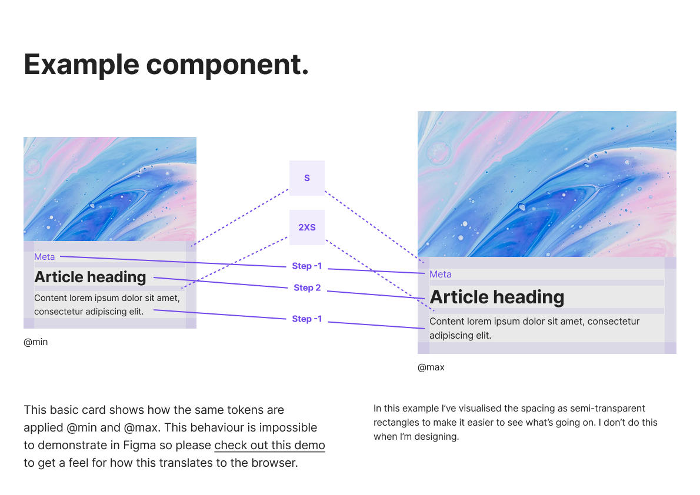

<figcaption>
  —{' '}
  <cite>
    [Utopian project kickstarter with modes |
    Figma](https://www.figma.com/community/file/1385968382811167454)
  </cite>
</figcaption>

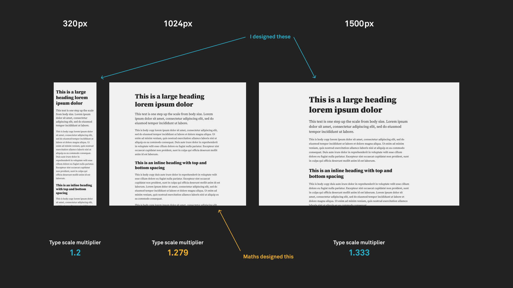

<figcaption>
  —{' '}
  <cite>
    [Designing with fluid type scales |
    Utopia](https://utopia.fyi/blog/designing-with-fluid-type-scales)
  </cite>
</figcaption>

実際にUtopiaを使うとどのようなウェブページができるかについては、[公式のデモ](https://demo.utopia.fyi/)や[Showcaseの事例](https://utopia.fyi/showcase/)を開いてリサイズしてみるとわかりやすい。

Utopiaは、デザイナーの設計の一部を自動化すると同時に制約するアプローチでもある。これが良い方向に働くこともあれば、そうならないこともあるだろう。特にモジュラースケールは思うように機能しないことも多いので、そのまま採用すると不便かもしれない。これについて、[モジュラースケールの等比数列の代わりに調和数列を使うことを提案するものもある](https://standard.shiftbrain.com/blog/music-math-typography)。また現在開発中のBootstrap 6では、[小さいサイズは固定値で大きいサイズはフルイドタイポグラフィという使い分けがなされている](https://github.com/twbs/bootstrap/blob/353324bd9409ef6c026738b702e59ddd05bf6f1a/scss/_root.scss#L69-L78)。

いずれにしても、レスポンシブを前提とした値のセットをデザイナーと開発者で共有するアイデアは有用に感じる。というのも、モバイル幅とデスクトップ幅で別々にデザインカンプを作成していると、それぞれで別物のデザインをしているような意識になることがしばしばある。そうしたとき、文字サイズや余白に対して、モバイル幅とデスクトップ幅で共通のスケールを適用するという意識が生まれることで、良き制約として機能することを期待できるからだ。

## キャンバスインからコンテンツアウトへ

これまでの僕の経験として、デザインカンプにおけるグリッドシステムの扱いには非常に苦心してきた。この指定をもとにCSSを作成しても、レスポンシブデザインとしてうまくいったと思えることはほとんどない。多くのデザイナーはそれを静的なアートボード上のガイドとしか捉えておらず、ビューポートが伸縮したときに機能するかどうかまでは基本的に考えていないからだ。

そもそもグリッドシステムは、歴史的には紙媒体のデザインのなかで確立されてきた。紙媒体のデザインでは、レイアウトの出発点は紙面である。特定の紙面の寸法と比率に基づいて列と行のグリッドシステムに分割し、そのモジュール上にコンテンツを配置する。これは[キャンバスインとも呼ばれる](https://markboulton.co.uk/journal/a-richer-canvas/)。紙面という固定された明確な制約に基づいたプロセスであり、ビューポートのサイズが不定なウェブとは一線を画す。

多くのレスポンシブデザインはいまだキャンバスインの発想で作成されている。デバイスのサイズごとに別々のアートボードを作成し、アートボードごとにグリッドを設定し、そのグリッドに合わせて要素を複製してサイズ調整する。これによって生じるのは、どのようなデバイスにもなめらかに適応するレスポンシブデザインではなく、ブレークポイントごとに分離された別々のデザインの出し分けだ。これについて『Every Layout』では次のように述べられている。

> Every Layoutでは、幅を基準としたメディアクエリの使用を避けています。メディアクエリでは、レイアウトの再構成をハードコーディングで表現することになります。さらに、要素やコンポーネントが実際に置かれている状況と結びついていないのです。先ほどの例のように、インターフェイスのスケーリングを個別の「ブレイクポイント」に基づいて行うのは恣意的な設定です。`960px`は何か特別な幅なのでしょうか？　`959px`で小さいサイズになることが本当に適切だといえるのでしょうか？
>
> 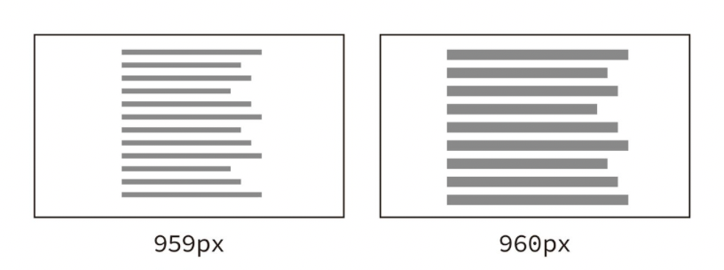
>
> <figcaption>ブレイクポイントを使用すると、1pxの違いが大きな「ジャンプ」になります。</figcaption>

<figcaption>
  — ヘイドン・ピカリング、アンディ・ベル著、安田祐平、横内宏樹監訳『<cite>Every Layout</cite>
  』、株式会社ボーンデジタル、2021年
</figcaption>

ウェブは流動的なメディアであり、ユーザーのビューポートのサイズを事前に知ることはできない。つまり、紙媒体のような固定的なグリッドシステムは成り立たない。だから発想を転換しなければいけない。

グリッドには頼れない代わりに、ウェブではコンテンツからレイアウトを作成すると考える。ブレークポイントごとにページ全体を別物のレイアウトに書き換えてしまうのではなく、ビューポートの拡大にともなう個々のコンテンツの変化に着目し、必要に応じて個別に調整していくというアプローチだ。これを[コンテンツアウトと呼ぶ](https://markboulton.co.uk/journal/theinbetween/)。

具体的な解説がweb.devにあったので引用しよう。特に動画の例を見るとわかりやすい。

> <video controls loop muted playsinline>
>   <source
>     src={(await import('./assets/designing-the-in-between/content_out-resize.mp4')).default}
>   />
> </video>
> <figcaption>画面が広くなると、ウィジェットの形状がそれに応じて変化します。</figcaption>
>
> （中略）
>
> ### 小さく始め、徐々に大きくして主要なブレークポイントを選択する
>
> まず小さい画面サイズに収まるようにコンテンツを設計し、ブレークポイントが必要になるまで画面を拡大します。これにより、ページのブレークポイントの数を最小限に抑え、コンテンツに基づいて最適化できます。
>
> 次の例では、このページの冒頭にある天気予報ウィジェットの例について説明します。最初のステップは、予報を小さい画面に適切に表示することです。
>
> <Image
>   class="w-xs"
>   src={import('./assets/designing-the-in-between/content_out-narrower.png')}
>   alt="モバイル幅の天気アプリ"
> />
> <figcaption>幅が狭いアプリ。</figcaption>
>
> 次に、要素間の空白が広すぎてウィジェットが見づらくなるまでブラウザのサイズを変更します。判断は主観的ですが、`600px`を超えると明らかに広すぎます。
>
> <Image
>   class="w-lg"
>   src={import('./assets/designing-the-in-between/content_out-wider.png')}
>   alt="アイテム同士の間隔が広い天気アプリ"
> />
> <figcaption>このサイズでは、アプリのレイアウトを変更する必要があります。</figcaption>

<figcaption>
  —{' '}
  <cite>
    [レスポンシブ ウェブ デザインの基本  |  Articles  | 
    web.dev](https://web.dev/articles/responsive-web-design-basics?hl=ja)
  </cite>
</figcaption>

また「[CSS Container Queries For Designers](https://ishadeed.com/article/container-queries-for-designers/)」や「[An Interactive Guide to CSS Container Queries](https://ishadeed.com/article/css-container-query-guide/)」では、ほかにもいくつかのレイアウトパターンをContainer Queriesを使って作成する方法が紹介されている。

しかし、このような設計をするにはコードを書きながらでないと難しい。デザイナーにとってはそこが障壁だろう。このやり方だけでページ全体のデザインを考えることも現実的ではないかもしれない。そこでデザインカンプでの作業を前提としたうえで、もう少し別の観点も紹介しよう。

## グリッドシステムとの向き合い方

デザインカンプのグリッドシステムとしてもっとも典型的な設定は、ページを横に12分割するカラムだろう。一方、このようなグリッドに忠実なCSSを実装しても、あまり良い結果にならないことが多い。特定の幅のデザインカンプで良い見栄えになるとしても、レイアウトをそのカラムに沿わせたままウィンドウをリサイズするとたいてい不恰好だったり意図に反する結果になる。

いくつか例を出そう。12カラムのうち左の3カラムがサイドバーになっているレイアウトがあるとする。そのサイドバーの幅がページ全体の3/12になるように実装すると、ページ全体の幅が少し狭まるだけでサイドバーの領域も狭まりすぎてしまうことが推測できる。

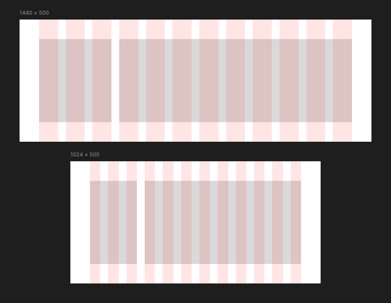

もしくは、12カラムの左右から2カラムずつずらして、8カラム分のコンテンツ領域を中央に配置するとする。この場合も同じく、そのコンテンツ領域をページ全体の8/12になるように実装すると、ページ全体の幅が少し狭まるだけでコンテンツ領域の幅も狭まりすぎてしまう。

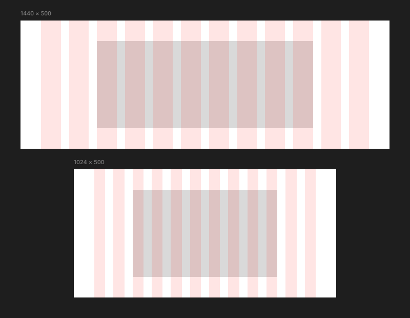

これについてのシンプルな解決策は、12カラムグリッドのようなガイドを拠り所にするのをやめることだ。コンテンツアウトの発想でデザインするなら、そのようなガイドがなくとも必要に応じたレイアウト調整がなされるだろう。

では、前述の例をコンテンツアウトの発想で実装するならどうするか。サイドバーの幅には相対値の代わりに絶対値を指定した方が、より幅広い範囲のビューポートにおいて妥当に表示できそうだ。中央に配置された8カラムのコンテンツ領域は、相対値を指定する代わりに`max-width`で絶対値を指定した方が、狭すぎる状態になることがなく、空間を無駄にせずに済む。

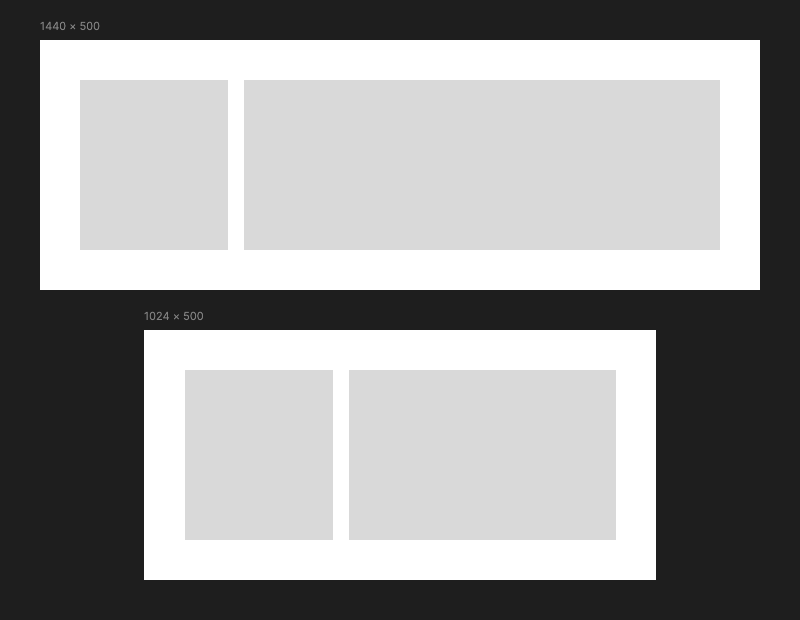

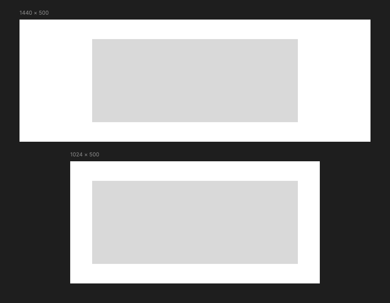

もっとも、これは周囲のコンテンツとの関係や別ページとの整合性にも関わる問題なので、一概にこの方が良いとは言い切れない。しかし、グリッドに沿わせるようにレイアウトすることは根本的にキャンバスインの発想で、ビューポートの変化に耐えられない傾向にある。

一方で現実的には、レイアウトの当たりをつけるのにグリッドがなければ難しいこともある。だから落とし所として、「グリッドを使うのは良いがあくまで静的なレイアウトの目安として使う。実装の際には必ずしも採用しない」。デザイナーと開発者の間でそのように認識を合わせるのが良いのかもしれない。

また、コンテンツアウトの発想での解釈ができるのは、必ずしもグリッドに沿わせなくてもレイアウトが成立する余地があるときだけだ。特にこのような調整が難しくなるのは、デザイナーがあらゆる要素をグリッドに沿わせようと固執しているときである。

たとえば[Spectrum](https://spectrum.adobe.com/)では、グリッドにおける「レイアウト領域（layout regions）」の概念が文書化されている。これはグリッド上に配置される、任意のコンテンツを囲うコンテナのようなものを指す。

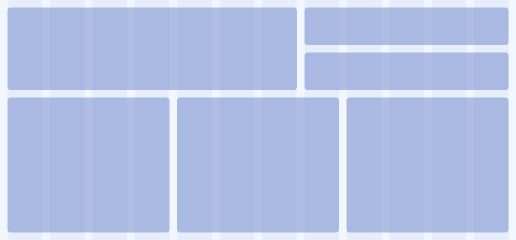

<figcaption>
  — <cite>[Responsive grid - Spectrum](https://spectrum.adobe.com/page/responsive-grid/)</cite>
</figcaption>

このレイアウト領域のルールでは、レイアウト領域の縁はグリッドに沿わせるが、領域の内側のレイアウトは沿わせてはならない。そこまでもがグリッドに沿っていると、ボタンのラベルの長さなどの応じたレイアウトの調整が効かなくなってしまうからだ。

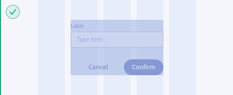
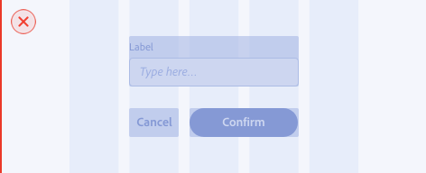

<figcaption>
  — <cite>[Responsive grid - Spectrum](https://spectrum.adobe.com/page/responsive-grid/)</cite>
</figcaption>

これは言い換えれば、レイアウト領域はキャンバスイン、レイアウト領域の内側はコンテンツアウトでレイアウトすることだとも言える。マクロなレイアウトはグリッドを拠り所にしてレイアウトしつつ、外側から規定しづらいミクロなレイアウトはコンテンツに応じて調整可能にするという使い分けである。その意味でキャンバスインとコンテンツアウトは、トップダウンとボトムアップの関係にあると言ってもよい。これは些細なことのようで、レスポンシブデザインを成立させるうえで重要な視点だ。

レイアウト領域の内側では、グリッドに由来しない、何かしらの絶対的な値に基づいてレイアウトをする。そこで前述したUtopiaの例のように、利用する余白サイズのパターンを決めて用いることで、グリッドシステムにも似たシステム的なアプローチが実現される。

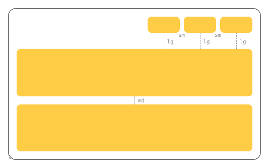

<figcaption>
  — <cite>[gridless.design](https://gridless.design/for-designers)</cite>
</figcaption>

また別の例を出そう。あるレイアウト領域のなかにまた別のレイアウトが入れ子になることがある。サイドバーと隣り合ったメインカラムのなかに、グリッド状のカードビューを表示するような場合だ。もしその内側のレイアウトも全体のグリッドに沿わせなければならないと解釈すれば、いろいろと窮屈なことになるだろう。しかしFigmaでは、外側のアートボードだけではなく、あらゆるフレームに対してグリッドを設定することができる。


<figcaption>
  —{' '}
  <cite>
    [Everything you need to know about layout grids in
    Figma](https://www.figma.com/best-practices/everything-you-need-to-know-about-layout-grids/)
  </cite>
</figcaption>

これによってレイアウト領域の内側では、個々のコンテンツに応じたガイドの設定をすることもできる。アートボードレベルのグリッドに沿わせることだけが正しいやり方なのではない。

---

「PLAID Designer’s Advent Calendar 2025」の2日目は、tomaさんによる「[プロダクトデザイナーが実践するtoB SaaSのNPS調査](https://note.com/tmtkd/n/n69238dcd83da)」です。

## 参考資料

- [Responsive Web Design – A List Apart](https://alistapart.com/article/responsive-web-design/)
- [A Richer Canvas - Mark Boulton](https://markboulton.co.uk/journal/a-richer-canvas/)
- [A New Canon - Mark Boulton](https://markboulton.co.uk/journal/anewcanon/)
- [The In-Between - Mark Boulton](https://markboulton.co.uk/journal/theinbetween/)
- [Responsive Design: Patterns and Principles, Chapter 5: Designing the Infinite Grid](https://ethanmarcotte.com/books/responsive-design-patterns-and-principles/full/chap05/)
- [The Atomic Workflow | Atomic Design by Brad Frost](https://atomicdesign.bradfrost.com/chapter-4/)
- [Resilient Web Design—Chapter 3](https://resilientwebdesign.com/chapter3/)
- [Relearn CSS layout: Every Layout](https://every-layout.dev/)
- [Meet Utopia: Designing And Building With Fluid Type And Space Scales — Smashing Magazine](https://www.smashingmagazine.com/2021/04/designing-developing-fluid-type-space-scales/)
- [The new responsive: Web design in a component-driven world  |  Articles  |  web.dev](https://web.dev/articles/new-responsive)
- [gridless.design](https://gridless.design/)
- [Macro layouts  |  web.dev](https://web.dev/learn/design/macro-layouts)
- [Micro layouts  |  web.dev](https://web.dev/learn/design/micro-layouts)
- [The Guide To Responsive Design In 2023 and Beyond](https://ishadeed.com/article/responsive-design/)
- [Complete CSS - Piccalilli](https://piccalil.li/complete-css/)
