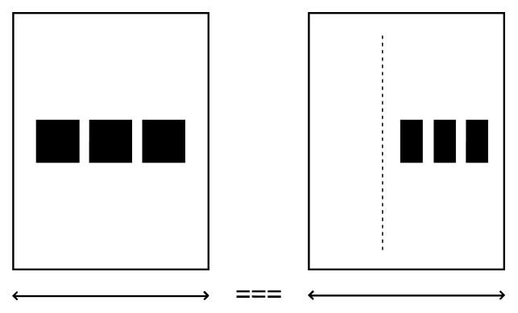
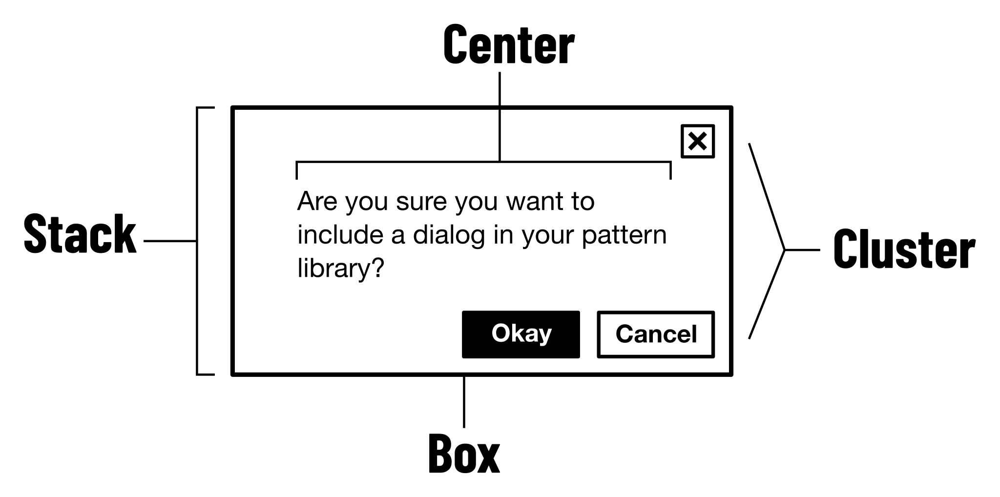
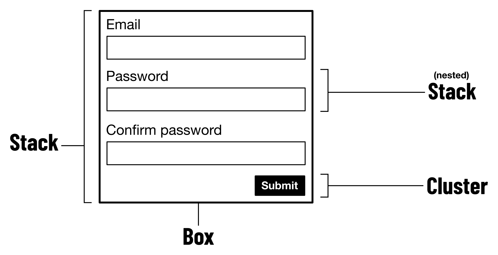
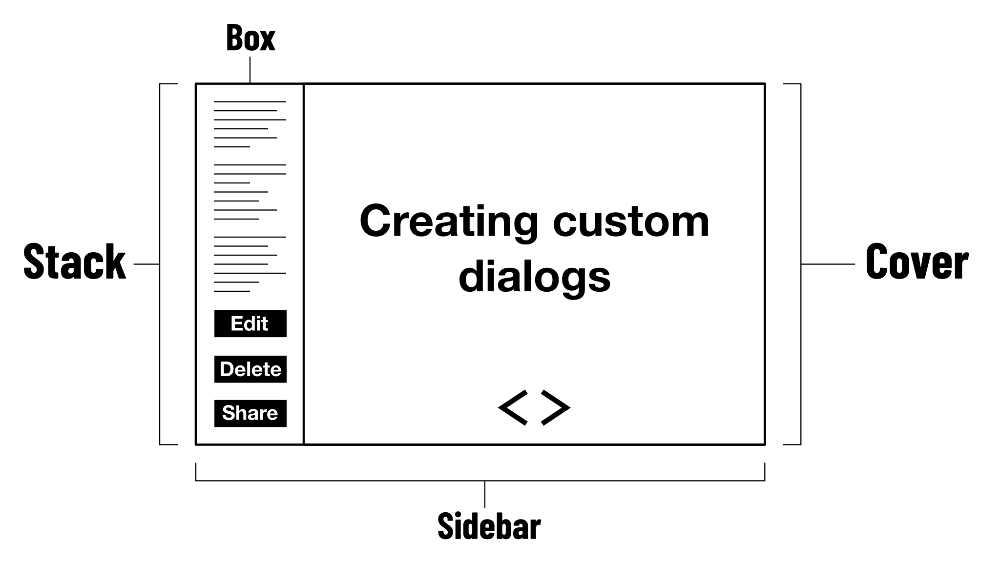

import SmartIframe from '#components/SmartIframe.astro';

「[ウェブはデフォルトでレスポンシブ](https://web.archive.org/web/20170522090129/http://blog.andyhume.net/responsive-by-default/)」とかねてより言われている。それを妨げるようなスタイリングをしないかぎり、ウェブページのレイアウトはブラウザの表示幅に合わせて自動的に調整される。

レスポンシブデザインが普及する前、ウェブページは960pxの固定幅で作成することが一般的だった。当時のディスプレイ解像度は多くが1024pxの幅だったため、それに決め打ちした設計であった。

<figure>
```css
body {
  width: 960px;
}
```
</figure>

固定幅のレイアウトは、余計なことをしなければ得られたはずのレスポンシブな性質を損なうものである。こうした固定的な設定を避けて、より柔軟なレイアウト手法で置き換えるのがレスポンシブデザインという戦略だ。

たとえば固定幅のレイアウトは、代わりに最大幅を指定することで、表示幅が狭くてもそれに適応して収縮するようなレイアウトになる。

<figure>
```css
body {
  max-width: 960px;
}
```
</figure>

このとき、960pxという値は絶対のものではなくなる。幅は常に960pxではなく、広い範囲の中でのいずれかの値を取ることになる。960pxは境界値でしかない。あくまで妥当なレイアウトを実現するためのルールを提示しているのであって、唯一の解を強制するわけではないということ。

そして、特定の表示幅だけを前提とするのではなく、いかなる表示幅にも適応させると考えると、最大幅が960pxであることの必然性も薄れていく。決まった画面サイズに当てはめるよりも、コンテンツをどのように見せたいか——つまり、コンテンツにとってどの最大幅が適切かに基づいて値を設定すべきである。

## レイアウトプリミティブ

[Every Layout](https://every-layout.dev/)（[日本語訳版](https://www.borndigital.co.jp/book/24204/)）では、レスポンシブなレイアウトの最小要素を独自に定義し、それらを[レイアウトプリミティブ](https://every-layout.dev/rudiments/composition/)と呼んでいる。レイアウトプリミティブの特徴は、メディアクエリ無しでレイアウトの自動調整ができることと、それらを組み合わせて複合的なレイアウトを作成できることだ。

メディアクエリの問題は、特定の要素自身の大きさに基づいたルールを記述できないことにある。コンポーネントは300pxの幅のコンテナの中に配置されることもあれば、より広い500pxの幅のコンテナの中に配置されることもある。コンテナの大きさが異なれば、それに応じたレイアウトの調整が必要になることもあるが、メディアクエリではビューポートの幅に基づいたルールしか記述できない。

<figure>
  
  <figcaption>
    — <cite>[The Sidebar: Every Layout](https://every-layout.dev/layouts/sidebar/)</cite>
  </figcaption>
</figure>

こうした問題を克服すべく、レイアウトプリミティブでは、要素自身の大きさに基づいたレイアウト調整ができるCSSの手法が組み込まれている。これによって要素の配置や折り返し位置が自動で処理されることになるため、個別にメディアクエリを記述して制御する必要がなくなる。

さらにEvery Layoutでは、[ウェブにおけるレイアウトの多くはレイアウトプリミティブの組み合わせだけで実現できる](https://every-layout.dev/rudiments/composition/)と述べられている。メディアクエリに依存する従来のレイアウト手法では、個々の要素に応じた制御が難しく、その結果として汎用性や再利用性が制約されがちだった。しかしこれを打開することで、再利用の可能性が一気に開ける。

<figure>
  
  <figcaption>
    — <cite>[Composition: Every Layout](https://every-layout.dev/rudiments/composition/)</cite>
  </figcaption>
</figure>

<figure>
  
  <figcaption>
    — <cite>[Composition: Every Layout](https://every-layout.dev/rudiments/composition/)</cite>
  </figcaption>
</figure>

<figure>
  
  <figcaption>
    — <cite>[Composition: Every Layout](https://every-layout.dev/rudiments/composition/)</cite>
  </figcaption>
</figure>

言い換えれば、コンテンツに自律的に適応するレイアウト要素を組み合わせることで、より複雑なレイアウトを自己組織化によって成立させられるということ。スクリーンサイズごとのレイアウトをトップダウンに規定するのではなく、局所的なルールから全体がボトムアップに立ち上がる。[内からの構成](https://terkel.jp/archives/2021/11/every-layout/)と言ってもよいだろう。

このようなレイアウトプリミティブを駆使してレイアウトを構成することで、従来よりも効率的かつ堅牢なレスポンシブデザインが実現できるはずだ。

## パターンの紹介

レイアウトプリミティブの妙は、パターンとしての完成度の高さにある。ウェブでよくあるレイアウト表現が、自律的に機能するプリミティブとしてうまく再定義されている。モジュラーな設計を実現するうえでは、こうした抽象化の精度こそが肝になる。

Every Layoutの共著者である[Andy Bell](https://bell.bz/links/)は、後に[CUBE CSS](https://cube.fyi/)というCSS方法論を発表する。CUBE CSSには、レイアウトプリミティブにも似た[Composition](https://cube.fyi/composition.html)の概念があり、リファレンス実装として[それらのソースコードが公開されている](https://piccalil.li/blog/a-css-project-boilerplate/)。

僕が思うに、これらはEvery Layoutの例と比べて、より実用的なパターン集になっている。多くはEvery Layoutと変わらないが、中でもあまり使われないものを取り除いたり、不足していたものを追加したりすることで、よく使うものが取り揃った使いやすいライブラリになった。これをアップデート版のレイアウトプリミティブと考えてもよいだろう。

そこで、以降はCUBE CSSの例をもとに各レイアウトを簡単に紹介する。デモがついているので、ウインドウをリサイズしながら確認してほしい。これらのパターンを学ぶことで、開発者がより良い実装ができるだけでなく、デザイナーにとっても堅牢な設計パターンを理解するための助けになるだろう。

## Flow (Stack)

垂直方向に積み重ねられた要素の間に一律したマージンを設定する。特定の要素の余白だけ調整することもできる。

<figure>
  <SmartIframe src="./flexible-layout-compositions/demo/flow.html" />
</figure>

🔗 [Flowのデモページを開く](./flexible-layout-compositions/demo/flow.html)

<figure>

{/* prettier-ignore */}
```html
<div class="flow">
  <p>Nullam id dolor id nibh ultricies vehicula ut id elit. Nulla vitae elit libero, a pharetra augue.</p>
  <p>Nulla vitae elit libero, a pharetra augue. Cras justo odio, dapibus ac facilisis in, egestas eget quam.</p>
  <p style="--flow-space: 3em"><code>--flow-space</code> set with an inline style to 3em: <code>style="--flow-space: 3em"</code></p>
</div>
```

</figure>

<figure>

{/* prettier-ignore */}
```css
/*
FLOW COMPOSITION
Like the Every Layout stack: https://every-layout.dev/layouts/stack/
Info about this implementation: https://piccalil.li/quick-tip/flow-utility/
*/
.flow > * + * {
  margin-top: var(--flow-space, 1em);
}
```

<figcaption>
  — [cube-boilerplate/src/css/compositions/flow.css at main ·
  Set-Creative-Studio/cube-boilerplate](https://github.com/Set-Creative-Studio/cube-boilerplate/blob/main/src/css/compositions/flow.css)
</figcaption>
</figure>

### 参考資料

- [Axiomatic CSS and Lobotomized Owls – A List Apart](https://alistapart.com/article/axiomatic-css-and-lobotomized-owls/)
- [Managing Flow and Rhythm with CSS Custom Properties ◆ 24 ways](https://24ways.org/2018/managing-flow-and-rhythm-with-css-custom-properties/)
- [The Stack: Every Layout](https://every-layout.dev/layouts/stack/)
- [My favourite 3 lines of CSS - Piccalilli](https://piccalil.li/blog/my-favourite-3-lines-of-css/)

## Wrapper (Center)

コンテンツを水平方向に中央配置して、最大幅を制限する。左右の余白を確保することで、狭い画面でもコンテンツが端に張り付かないようになっている。

<figure>
  <SmartIframe src="./flexible-layout-compositions/demo/wrapper.html" />
</figure>

🔗 [Wrapperのデモページを開く](./flexible-layout-compositions/demo/wrapper.html)

<figure>

```html
<div class="wrapper">
  <p>I am centered and have a nice, consistent gutter.</p>
</div>
```

</figure>

<figure>

{/* prettier-ignore */}
```css
/*
WRAPPER COMPOSITION
A common wrapper/container
*/
.wrapper {
  margin-inline: auto;
  max-width: clamp(16rem, var(--wrapper-max-width, 100vw), 80rem);
  padding-left: var(--gutter);
  padding-right: var(--gutter);
  position: relative;
}
```

<figcaption>
  — [cube-boilerplate/src/css/compositions/wrapper.css at main ·
  Set-Creative-Studio/cube-boilerplate](https://github.com/Set-Creative-Studio/cube-boilerplate/blob/main/src/css/compositions/wrapper.css)
</figcaption>
</figure>

### 参考資料

- [The Center: Every Layout](https://every-layout.dev/layouts/center/)
- [Use CSS Clamp to create a more flexible wrapper utility - Piccalilli](https://piccalil.li/blog/use-css-clamp-to-create-a-more-flexible-wrapper-utility/)

## Cluster

要素を水平方向に並べて、スペースが足りなくなったら自動的に折り返す。ラベルの長さに応じたレイアウトができる。

<figure>
  <SmartIframe src="./flexible-layout-compositions/demo/cluster.html" />
</figure>

🔗 [Clusterのデモページを開く](./flexible-layout-compositions/demo/cluster.html)

<figure>

```html
<div class="cluster">
  <div>Item 1</div>
  <div>Item 2</div>
  <div>Item 3</div>
  <div>Item 4</div>
  <div>Item 5</div>
  <div>Item 6</div>
  <div>Item 7</div>
  <div>Item 8</div>
</div>
```

</figure>

<figure>

{/* prettier-ignore */}
```css
/*
CLUSTER
More info: https://every-layout.dev/layouts/cluster/
A layout that lets you distribute items with consitent
spacing, regardless of their size

CUSTOM PROPERTIES AND CONFIGURATION
--gutter (var(--space-s-m)): This defines the space
between each item.

--cluster-horizontal-alignment (flex-start) How items should align
horizontally. Can be any acceptable flexbox aligmnent value.

--cluster-vertical-alignment How items should align vertically.
Can be any acceptable flexbox alignment value.
*/

.cluster {
  display: flex;
  flex-wrap: wrap;
  gap: var(--gutter, var(--space-s-m));
  justify-content: var(--cluster-horizontal-alignment, flex-start);
  align-items: var(--cluster-vertical-alignment, center);
}
```

<figcaption>
  — [cube-boilerplate/src/css/compositions/cluster.css at main ·
  Set-Creative-Studio/cube-boilerplate](https://github.com/Set-Creative-Studio/cube-boilerplate/blob/main/src/css/compositions/cluster.css)
</figcaption>
</figure>

### 参考資料

- [The Cluster: Every Layout](https://every-layout.dev/layouts/cluster/)

## Repel

2つの要素を両端に配置し、スペースがあるときは引き離し、スペースが足りなくなったら積み重ねる。Every Layoutには存在しないパターン。

<figure>
  <SmartIframe src="./flexible-layout-compositions/demo/repel.html" />
</figure>

🔗 [Repelのデモページを開く](./flexible-layout-compositions/demo/repel.html)

<figure>

```html
<div class="repel">
  <div>Item 1 repels item 2</div>
  <div>Item 2 repels item 1</div>
</div>
```

</figure>

<figure>

{/* prettier-ignore */}
```css
/*
REPEL
A little layout that pushes items away from each other where
there is space in the viewport and stacks on small viewports

CUSTOM PROPERTIES AND CONFIGURATION
--gutter (var(--space-s-m)): This defines the space
between each item.

--repel-vertical-alignment How items should align vertically.
Can be any acceptable flexbox alignment value.
*/
.repel {
  display: flex;
  flex-wrap: wrap;
  justify-content: space-between;
  align-items: var(--repel-vertical-alignment, center);
  gap: var(--gutter, var(--space-s-m));
}

.repel[data-nowrap] {
  flex-wrap: nowrap;
}
```

<figcaption>
  — [cube-boilerplate/src/css/compositions/repel.css at main ·
  Set-Creative-Studio/cube-boilerplate](https://github.com/Set-Creative-Studio/cube-boilerplate/blob/main/src/css/compositions/repel.css)
</figcaption>
</figure>

## Sidebar

サイドバーとメインコンテンツを横に並べるパターン。サイドバーは指定した幅になり、メインコンテンツは残りのスペースを埋める。ビューポートの幅が狭くなり、両方を横に並べるスペースがなくなると、自動的に縦に積み重なる。

<figure>
  <SmartIframe src="./flexible-layout-compositions/demo/sidebar.html" />
</figure>

🔗 [Sidebarのデモページを開く](./flexible-layout-compositions/demo/sidebar.html)

<figure>

{/* prettier-ignore */}
```html
<div class="sidebar">
  <div>I am the sidebar</div>
  <div class="flow">
    <h1>I am the content</h1>
    <p>Etiam porta sem malesuada magna mollis euismod. Cras mattis consectetur purus sit amet fermentum.</p>
    <p>Cum sociis natoque penatibus et magnis dis parturient montes, nascetur ridiculus mus. Vestibulum id ligula porta felis euismod semper.</p>
  </div>
</div>
```

</figure>

<figure>

{/* prettier-ignore */}
```css
/*
SIDEBAR
More info: https://every-layout.dev/layouts/sidebar/
A layout that allows you to have a flexible main content area
and a "fixed" width sidebar that sits on the left or right.
If there is not enough viewport space to fit both the sidebar
width *and* the main content minimum width, they will stack
on top of each other

CUSTOM PROPERTIES AND CONFIGURATION
--gutter (var(--space-size-1)): This defines the space
between the sidebar and main content.

--sidebar-target-width (20rem): How large the sidebar should be

--sidebar-content-min-width(50%): The minimum size of the main content area

EXCEPTIONS
.sidebar[data-direction='rtl']: flips the sidebar to be on the right
*/
.sidebar {
  display: flex;
  flex-wrap: wrap;
  gap: var(--gutter, var(--space-s-l));
}

.sidebar > :first-child {
  flex-basis: var(--sidebar-target-width, 20rem);
  flex-grow: 1;
}

.sidebar > :last-child {
  flex-basis: 0;
  flex-grow: 999;
  min-width: var(--sidebar-content-min-width, 50%);
}
```

<figcaption>
  — [cube-boilerplate/src/css/compositions/sidebar.css at main ·
  Set-Creative-Studio/cube-boilerplate](https://github.com/Set-Creative-Studio/cube-boilerplate/blob/main/src/css/compositions/sidebar.css)
</figcaption>
</figure>

### 参考資料

- [The Sidebar: Every Layout](https://every-layout.dev/layouts/sidebar/)
- [Complex conditional width using flex-basis with clamp: Every Layout](https://every-layout.dev/blog/sidebar-flex-basis-clamp/)
- [A revisit of the Every Layout sidebar with :has() and selector performance - Piccalilli](https://piccalil.li/blog/a-revisit-of-the-every-layout-sidebar-with-has-and-selector-performance/)

## Switcher

2つの要素を横に並べ、コンテナの幅が指定した閾値を下回ると縦に積み重なる。

<figure>
  <SmartIframe src="./flexible-layout-compositions/demo/switcher.html" />
</figure>

🔗 [Switcherのデモページを開く](./flexible-layout-compositions/demo/switcher.html)

<figure>

```html
<div class="switcher">
  <div>Item 1</div>
  <div>Item 2</div>
</div>
```

</figure>

<figure>

{/* prettier-ignore */}
```css
/*
SWITCHER
More info: https://every-layout.dev/layouts/switcher/
A layout that allows you to lay **2** items next to each other
until there is not enough horizontal space to allow that.

CUSTOM PROPERTIES AND CONFIGURATION
--gutter (var(--space-size-1)): This defines the space
between each item

--switcher-target-container-width (40rem): How large the container
needs to be to allow items to sit inline with each other

--switcher-vertical-alignment How items should align vertically.
Can be any acceptable flexbox alignment value.
*/
.switcher {
  display: flex;
  flex-wrap: wrap;
  gap: var(--gutter, var(--space-s-l));
  align-items: var(--switcher-vertical-alignment, flex-start);
}

.switcher > * {
  flex-grow: 1;
  flex-basis: calc((var(--switcher-target-container-width, 40rem) - 100%) * 999);
}

/* Max 2 items,
so anything greater than 2 is full width */
.switcher > :nth-child(n + 3) {
  flex-basis: 100%;
}
```

<figcaption>
  — [cube-boilerplate/src/css/compositions/switcher.css at main ·
  Set-Creative-Studio/cube-boilerplate](https://github.com/Set-Creative-Studio/cube-boilerplate/blob/main/src/css/compositions/switcher.css)
</figcaption>
</figure>

### 参考資料

- [The Flexbox Holy Albatross: HeydonWorks](https://heydonworks.com/article/the-flexbox-holy-albatross/)
- [The Flexbox Holy Albatross Reincarnated: HeydonWorks](https://heydonworks.com/article/the-flexbox-holy-albatross-reincarnated/)
- [The Switcher: Every Layout](https://every-layout.dev/layouts/switcher/)

## Grid

グリッドレイアウトを自動的に生成する。指定した最小幅を保ちながら、利用可能なスペースに応じて列数を自動調整する。

<figure>
  <SmartIframe src="./flexible-layout-compositions/demo/grid.html" />
</figure>

🔗 [Gridのデモページを開く](./flexible-layout-compositions/demo/grid.html)

<figure>

```html
<div class="grid">
  <div>Item 1</div>
  <div>Item 2</div>
  <div>Item 3</div>
  <div>Item 4</div>
  <div>Item 5</div>
  <div>Item 6</div>
  <div>Item 7</div>
  <div>Item 8</div>
</div>
```

</figure>

<figure>

{/* prettier-ignore */}
```css
/* AUTO GRID
Related Every Layout: https://every-layout.dev/layouts/grid/
More info on the flexible nature: https://piccalil.li/tutorial/create-a-responsive-grid-layout-with-no-media-queries-using-css-grid/
A flexible layout that will create an auto-fill grid with
configurable grid item sizes

CUSTOM PROPERTIES AND CONFIGURATION
--gutter (var(--space-s-m)): This defines the space
between each item.

--grid-min-item-size (14rem): How large each item should be
ideally, as a minimum.

--grid-placement (auto-fill): Set either auto-fit or auto-fill
to change how empty grid tracks are handled */

.grid {
  display: grid;
  grid-template-columns: repeat(
    var(--grid-placement, auto-fill),
    minmax(var(--grid-min-item-size, 16rem), 1fr)
  );
  gap: var(--gutter, var(--space-s-l));
}

/* A split 50/50 layout */
.grid[data-layout='halves'] {
  --grid-placement: auto-fit;
  --grid-min-item-size: clamp(16rem, 50vw, 33rem);
}

/* Three column grid layout */
.grid[data-layout='thirds'] {
  --grid-placement: auto-fit;
  --grid-min-item-size: clamp(16rem, 33%, 20rem);
}
```

<figcaption>
  — [cube-boilerplate/src/css/compositions/grid.css at main ·
  Set-Creative-Studio/cube-boilerplate](https://github.com/Set-Creative-Studio/cube-boilerplate/blob/main/src/css/compositions/grid.css)
</figcaption>
</figure>

### 参考資料

- [Incredibly Easy Layouts with CSS Grid - YouTube](https://www.youtube.com/watch?v=tFKrK4eAiUQ)
- [The Grid: Every Layout](https://every-layout.dev/layouts/grid/)
- [Create a responsive grid layout - Piccalilli](https://piccalil.li/blog/create-a-responsive-grid-layout-with-no-media-queries-using-css-grid/)
