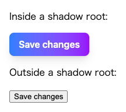

ページ内のスタイルの競合を避けるため、Shadow DOMのなかでTailwind CSSを読み込みたいという場面があった。これはTailwind 3では問題なく実現できたが、Tailwind 4では一部のスタイルが適用されなくなる問題が発生した。

具体的な実装は次のようなものである。

<figure>

{/* prettier-ignore */}
```tsx
import root from 'react-shadow';

// ViteのExplicit URL Importsを使用する
// https://vite.dev/guide/assets.html#explicit-url-imports
import styleSheetURL from './index.css?url';

function Button() {
  return (
    <button className="rounded-lg bg-gradient-to-r from-blue-500 to-purple-600 px-4 py-2 font-semibold text-white shadow-lg transition duration-300 hover:scale-105 hover:from-blue-600 hover:to-purple-700">
      Save changes
    </button>
  );
}

function App() {
  return (
    <>
      <p>Inside a shadow root:</p>
      <root.div>
        <link rel="stylesheet" href={styleSheetURL} />
        <Button />
      </root.div>

      <p>Outside a shadow root:</p>
      <Button />
    </>
  );
}
```

</figure>

期待される描画結果は次の通り。

<figure>



</figure>

しかし実際には背景のグラデーションが適用されず、不完全な状態で表示されてしまった。

原因を調べてみると、どうやらTailwind 4で使用されている@propertyルールがShadow DOMのなかで動作しないせいであるようだ。Shadow DOMのなかでは@propertyルールが無視されて、カスタムプロパティが未定義扱いになってしまう。

Tailwind 4では、@propertyルールを使ってカスタムプロパティを定義している。一部のユーティリティはこれによって定義されたカスタムプロパティに依存しているため、Shadow DOMのなかでは正しく機能しない。

<figure>

{/* prettier-ignore */}
```css
@layer utilities {
  .bg-gradient-to-r {
    --tw-gradient-position: to right in oklab;
    background-image: linear-gradient(var(--tw-gradient-stops));
  }
  .from-blue-500 {
    --tw-gradient-from: var(--color-blue-500);
    --tw-gradient-stops: var(--tw-gradient-via-stops, var(--tw-gradient-position), var(--tw-gradient-from) var(--tw-gradient-from-position), var(--tw-gradient-to) var(--tw-gradient-to-position));
  }
  .to-purple-600 {
    --tw-gradient-to: var(--color-purple-600);
    --tw-gradient-stops: var(--tw-gradient-via-stops, var(--tw-gradient-position), var(--tw-gradient-from) var(--tw-gradient-from-position), var(--tw-gradient-to) var(--tw-gradient-to-position));
  }
}

/* ... */

@property --tw-gradient-position {
  syntax: "*";
  inherits: false;
}
@property --tw-gradient-from {
  syntax: "<color>";
  inherits: false;
  initial-value: #0000;
}
@property --tw-gradient-via {
  syntax: "<color>";
  inherits: false;
  initial-value: #0000;
}
@property --tw-gradient-to {
  syntax: "<color>";
  inherits: false;
  initial-value: #0000;
}
@property --tw-gradient-stops {
  syntax: "*";
  inherits: false;
}
@property --tw-gradient-via-stops {
  syntax: "*";
  inherits: false;
}
@property --tw-gradient-from-position {
  syntax: "<length-percentage>";
  inherits: false;
  initial-value: 0%;
}
@property --tw-gradient-via-position {
  syntax: "<length-percentage>";
  inherits: false;
  initial-value: 50%;
}
@property --tw-gradient-to-position {
  syntax: "<length-percentage>";
  inherits: false;
  initial-value: 100%;
}

/* ... */

@layer properties {
  @supports ((-webkit-hyphens: none) and (not (margin-trim: inline))) or ((-moz-orient: inline) and (not (color:rgb(from red r g b)))) {
    *, ::before, ::after, ::backdrop {
      --tw-gradient-position: initial;
      --tw-gradient-from: #0000;
      --tw-gradient-via: #0000;
      --tw-gradient-to: #0000;
      --tw-gradient-stops: initial;
      --tw-gradient-via-stops: initial;
      --tw-gradient-from-position: 0%;
      --tw-gradient-via-position: 50%;
      --tw-gradient-to-position: 100%;
    }
  }
}
```

</figure>

しかし、@propertyルールが使用できない環境のためのフォールバックも実装されている。`@layer properties`の内側にあるフィーチャークエリがそれである。[MozillaとSafariのためとコメントされている](https://github.com/tailwindlabs/tailwindcss/blob/v4.1.11/packages/tailwindcss/src/ast.ts#L697-L705)が、ブラウザを問わずこれが有効になるように書き換えられればうまく動作するはずだ。

やり方はいくつか考えられるが、PostCSSプラグインとしてASTを経由して書き換えることにした。要件としては次の2つだ。

- @propertyルールを削除する（削除しなくても動作するが、不要なものはない方がよいため）
- `@layer properties`のなかにある宣言ブロックを有効にするために、その間にあるフィーチャークエリだけを取り除く

これに準じて次のように実装した。

`postcss.config.ts`:

<figure>

```ts
import type { Plugin } from 'postcss';
import type { Config } from 'postcss-load-config';

// @propertyルールはShadow DOM内で動作しないため削除する
const removeAtProperty: Plugin = {
  postcssPlugin: 'remove-at-property',
  AtRule: {
    property(atRule) {
      atRule.remove();
    },
  },
};

// `@layer properties`の内側にあるフィーチャークエリを取り除いて、@propertyルールのフォールバックをすべてのブラウザで有効化する
// https://github.com/tailwindlabs/tailwindcss/blob/v4.1.11/packages/tailwindcss/src/ast.ts#L697-L705
const transformPropertiesLayer: Plugin = {
  postcssPlugin: 'transform-properties-layer',
  AtRule: {
    layer(atRule) {
      if (atRule.params !== 'properties') {
        return;
      }

      atRule.walkAtRules('supports', (supportsRule) => {
        const supportedRules = supportsRule.nodes;

        supportsRule.remove();

        if (supportedRules) {
          atRule.append(supportedRules);
        }
      });
    },
  },
};

const config: Config = {
  plugins: [removeAtProperty, transformPropertiesLayer],
};

export default config;
```

</figure>
````
