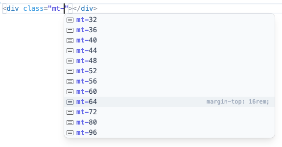

Tailwind CSSでは、テーマ変数の`--spacing`に応じてmarginユーティリティなどのスペースに関するCSSが生成される。`--spacing`ではほかのテーマ変数と違って、値を一つひとつ指定するのではなく、乗数となる値を一つ指定することで、その計算式が値として用いられる仕組みだ。

<figure>

```css
.m-8 {
  margin: calc(var(--spacing) * 8);
}
```

</figure>

これによって、ユーティリティのキーには自由な数値を指定できるようになっている。

一方エディタでの編集時には、事前設定された値がサジェストされるようになっている。これによって、デフォルトの選択肢を提案しつつもそこから外れた値も使用できるという緩い制約として機能する。

<figure>



</figure>

これらのサジェスト内容は[Tailwindのソースコード内に直接定義されているもの](https://github.com/tailwindlabs/tailwindcss/blob/v4.1.18/packages/tailwindcss/src/utilities.ts#L34-L69)で、ユーザーがカスタマイズすることはできない。したがって、もしデザインの制約として独自のスペーシングセットを定義したいという場合でも、これを直接変更することはできない。

しかし別の方法で設定することはできる。まず`--spacing`を無効化したうえで、有効なスペーシングセットを明示的に指定する。これによって、デフォルトのサジェスト内容の代わりに独自のものが表示されるようになる。

<figure>

```css
@theme {
  --spacing: initial;

  --spacing-0: 0px;
  --spacing-050: calc(2 / 16 * 1rem);
  --spacing-100: calc(4 / 16 * 1rem);
  --spacing-150: calc(6 / 16 * 1rem);
  /* ... */
}
```

</figure>

ただしこの場合、クラス名として自由な値を直接記述することはできなくなる。代わりにarbitrary valuesとして記述する必要がある。

<figure>

```html
<div class="m-150"><!-- ... --></div>

<div class="m-[calc(3/16*1rem)]"><!-- ... --></div>
```

</figure>

また、デフォルトの`--spacing`では常にrem単位が使用されるが、アクセシビリティの観点では好ましくない。具体的には、ブラウザやOSの文字サイズ拡大機能を使用した際、すべてにrem単位を使っていると文字サイズだけでなくすべてが同時に拡大してしまう（[Tailwind作者のAdam Wathanもこの設計は失敗だったと認めている](https://x.com/adamwathan/status/2003638134840656373)）。本来は、用途に応じてrem単位とpx単位を使い分けるべきだ。

`--spacing`を無効にすると、使用する単位をプロパティ別に設定できる。`--spacing-*`はあらゆるユーティリティに影響するが、個別のユーティリティにだけ有効なテーマ変数も定義されている。これらのテーマ変数はドキュメント化されていないが、[utilities.ts](https://github.com/tailwindlabs/tailwindcss/blob/v4.1.18/packages/tailwindcss/src/utilities.ts)に実装されている`themeKeys`の値を参考にすれば、次のようにしてプロパティ別のスペーシングを設定できる。

<figure>

```css
@theme {
  --spacing: initial;

  --margin-0: 0px;
  --margin-050: calc(2 / 16 * 1rem);
  --margin-100: calc(4 / 16 * 1rem);
  --margin-150: calc(8 / 16 * 1rem);
  /* ... */

  --padding-0: 0px;
  --padding-050: 2px;
  --padding-100: 4px;
  --padding-150: 8px;
  /* ... */
}
```

</figure>

<figure>

```html
<!-- margin: var(--margin-150); -->
<div class="m-150"><!-- ... --></div>

<!-- padding: var(--padding-150); -->
<div class="p-150"><!-- ... --></div>
```

</figure>
