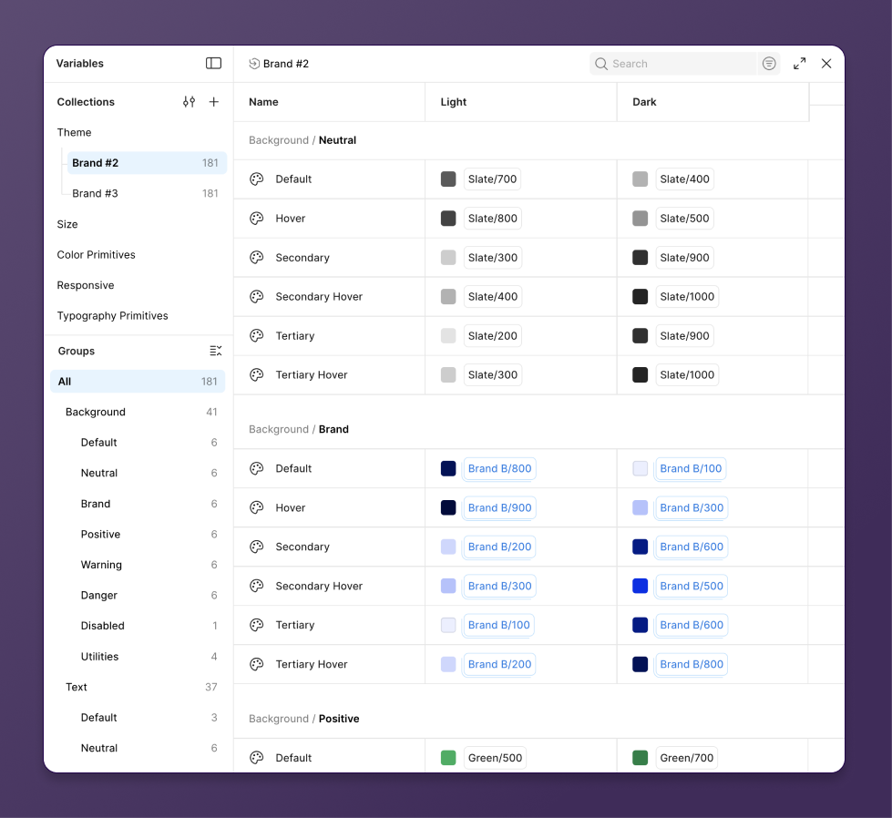
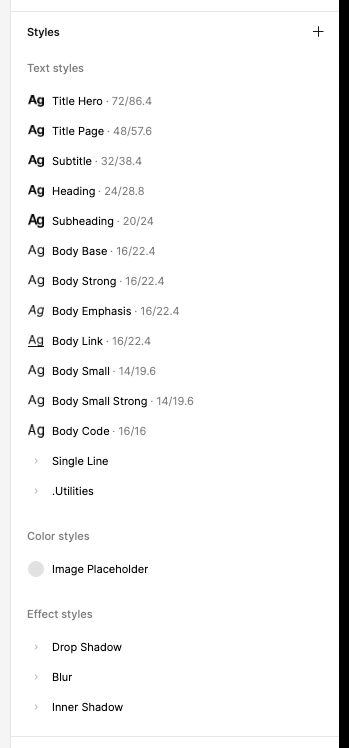

Figmaのスタイルやバリアブルを使うと、デザイン上のプロパティのセットや単一の値を再利用可能な形で定義して管理することができる。これらはそのままコードベースにも取り込むことが可能で、そのリファレンス実装として[Simple Design System](https://github.com/figma/sds)（以降はSDSと表記）が公開されている。Simple Design SystemではプレーンなCSSを使った実装例が示されているが、この記事ではTailwind CSSを使った例を紹介したい。

SDSではFigmaのコミュニティファイルが公開されているが、少し前に[extended collections](https://help.figma.com/hc/en-us/articles/36346281624471-Extend-a-variable-collection)がローンチされてから、新たに同じ作者によって[extended collectionsを使ったマルチブランド向けのバージョンも公開された](https://x.com/disco_lu/status/1994013332487975174)（[Simple Design System with Extended Collections](https://www.figma.com/community/file/1575803530898880325/simple-design-system-with-extended-collections)）。今回はこの新たなコミュニティファイルをもとにして、Tailwind CSSテーマをマルチブランド向けに構築する方法を解説していく。

なお、以降で取り上げる実装は[GitHubリポジトリとして公開している](https://github.com/yuheiy/sds-with-extended-collections-to-tailwindcss)。

## figma

figmaのvariablesの構造は次のようになっている。



<figcaption>— <cite>[Extended collections -> Structure recommendations | Figma](https://www.figma.com/community/file/1565049646137933322/extended-collections-structure-recommendations)</cite></figcaption>




figmaのプラン的に、extended collectionsにアクセスできる環境にないため、次の画像はExtended collections -> Structure recommendationsからの引用

https://help.figma.com/hc/en-us/articles/36346281624471-Extend-a-variable-collection

マルチブランド対応するうえでは、extended collectionsの使用可否にかかわらず、こちらのバージョンのコレクション構造をベースにした方がよいのでこちらを採用している

<table>
  <thead>
    <tr>
      <th>Collection</th>
      <th>Mode</th>
    </tr>
  </thead>
  <tbody>
    <tr>
      <td rowspan="2">Theme</td>
      <td>Light</td>
    </tr>
    <tr>
      <td>Dark</td>
    </tr>
    <tr>
      <td rowspan="3">Size</td>
      <td>Base</td>
    </tr>
    <tr>
      <td>Compact</td>
    </tr>
    <tr>
      <td>Comfortable</td>
    </tr>
    <tr>
      <td>Color Primitives</td>
      <td>Value</td>
    </tr>
    <tr>
      <td rowspan="3">Responsive</td>
      <td>Desktop</td>
    </tr>
    <tr>
      <td>Mobile</td>
    </tr>
    <tr>
      <td>Tablet</td>
    </tr>
    <tr>
      <td>Typography Primitives</td>
      <td>Default</td>
    </tr>
  </tbody>
</table>

この中で重要なのが、theme。実装ではブランドごとにこのコレクションの値を切り替える。

styles

## output

パッケージ構造

- `@acme/ui`
  - react components
  - 共通css
  - tailwind-merge config
- `@acme/theme-*`
  - テーマ固有のcss

次のようにして使う

```css
@import 'tailwindcss';
@import '@acme/ui/index.css';
@import '@acme/theme-default/index.css';
```

`@acme/ui/index.css`

```css
@theme {
  --font-*: initial;
  --color-*: initial;
  --spacing: initial;
  /* ... */
```

`@acme/theme-default/index.css`

```css
@theme {
  --color-slate-100: #f3f3f3;
  --color-slate-200: #e3e3e3;
  --color-slate-300: #cdcdcd;
  /* ... */
```

## transform

variables/stylesからのファイル生成

variablesに加えて、text stylesとeffect stylesをコードベースに取り込む。

出力するための選択肢

- 公式のexport
  - おそらくextended collectionsのために作成された機能だと思われる
  - https://help.figma.com/hc/en-us/articles/36346281624471-Extend-a-variable-collection
  - https://help.figma.com/hc/en-us/articles/36346281624471-Extend-a-variable-collection
  - 全てのvariablesを一括してexportできない
  - modeが別ファイルになる
  - stylesをexportできない
- figma rest api
  - variablesのexportはenterpriseのみ
- figma plugin api

Plugin APIでは無制限にvariables apiにアクセスできる
https://developers.figma.com/docs/plugins/api/figma-variables/

Rest APIではVariables APIにアクセスするにはenterprise planが必要
https://developers.figma.com/docs/rest-api/variables/


{/*  */}

variablesの問題
- 型がcolor/number/string/booleanしかない
- composite tokenを表現できない。typography / shadowなど

既存のプラグイン

- tokens studio
- TokensBrücke
  - 一度に出力できる
  - modeに対応
  - stylesを出力できる
    - variablesは、tokenのtypeのうち一部しかサポートしていない
    - https://help.figma.com/hc/ja/articles/14506821864087-%E3%83%90%E3%83%AA%E3%82%A2%E3%83%96%E3%83%AB-%E3%82%B3%E3%83%AC%E3%82%AF%E3%82%B7%E3%83%A7%E3%83%B3-%E3%83%A2%E3%83%BC%E3%83%89%E3%81%AE%E6%A6%82%E8%A6%81

出力方法によるトークン形式の違い

出力したトークンをstyle-dictionaryで取り込んでcssとtailwind-merge configを出力する

その前に、tailwindに適したトークン構造に変換する

---

処理の流れ

プロジェクト構成

build-tailwind-tokens

- トークンのマッピング
  - rewrite references
- theme tokens / typography tokens
  - テーマ別の出力
- トークンの加工
  - mapTokens
  - pxToRem
- モード別の出力
  - light-dark
  - size mode
    - switch toggle hack

```ts
import figmaTokens from './figma.tokens.json' with { type: 'json' };

const themeTokens = {
  color: {
    ...figmaTokens['Color Primitives'],
  },

  'background-color': {
    ...omit(themeGroup.Background, ['Utilities']),
  },

  'text-color': {
    ...omit(themeGroup.Text, ['Utilities']),
    icon: omit(themeGroup.Icon, ['Utilities']),
  },
```

| 名前 | Base | Compact | Comfortable |
| ---- | ---: | ------: | ----------: |
| 050  |    2 |       1 |           4 |
| 100  |    4 |       2 |           8 |
| 150  |    6 |       4 |          10 |


```html
<html data-size="comfortable">
  <!-- ... -->
</html>
```


```css
:root {
  --is-size-base: initial;
  --is-size-compact: ;
  --is-size-comfortable: ;

  &[data-size='compact'] {
    --is-size-base: ;
    --is-size-compact: initial;
    --is-size-comfortable: ;
  }

  &[data-size='comfortable'] {
    --is-size-base: ;
    --is-size-compact: ;
    --is-size-comfortable: initial;
  }
}

:root {
  --space-050: var(--is-size-base, 2px) var(--is-size-compact, 1px) var(--is-size-comfortable, 4px);
  --space-100: var(--is-size-base, 4px) var(--is-size-compact, 2px) var(--is-size-comfortable, 8px);
  --space-150: var(--is-size-base, 6px) var(--is-size-compact, 4px) var(--is-size-comfortable, 10px);
}
```
